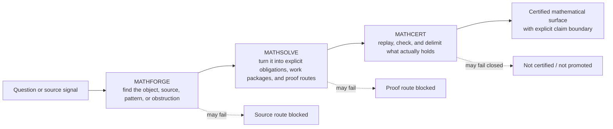

# Grand Challenge Mathematics Programme

Grand Challenge mathematics work is organized as a three-pillar system:

```text
MATHFORGE  ->  MATHSOLVE  ->  MATHCERT
discover       organize       certify
```

The programme exists to turn mathematical curiosity into checked understanding without confusing evidence, computation, exposition, or certification.

## What this programme is really for

Most mathematical work fails in one of two ways. Either it never becomes executable, so it stays at the level of inspiration, notes, and slogans. Or it does become executable, but the boundary between *suggesting* a claim and *establishing* a claim becomes blurred.

The Mathematics Programme exists to prevent both failures.

It is a system for turning difficult mathematical questions into governed campaigns that can:

- gather signals without pretending they are proofs;
- organize proof work without pretending organization is certification;
- certify only what survives exact replay and independent scrutiny.

In plain language: **the programme is designed to help us think boldly without letting us speak carelessly.**

## How truth moves through the programme



This separation is the heart of the programme.

A source can be exciting. A computation can be persuasive. A work package can be beautifully organized. None of those is yet certification.

The point of the three-pillar design is to keep the transitions explicit:

- **MATHFORGE** is where a mathematical possibility becomes a disciplined object of inquiry.
- **MATHSOLVE** is where that object becomes a campaign with named obligations and exact successor moves.
- **MATHCERT** is where the surviving claim is replayed, bounded, and either admitted or refused.

## Why the three pillars are separate

Each pillar protects against a different kind of self-deception.

| Pillar | What it does | What it prevents |
|---|---|---|
| **MATHFORGE** | Reconstructs sources, signals, heuristics, examples, and candidate routes. | Mistaking a promising lead for a governed mathematical object. |
| **MATHSOLVE** | Builds theorem spines, work packages, proof obligations, and handoffs. | Mistaking a research programme for a completed result. |
| **MATHCERT** | Replays exact statements, checks certificates, and fixes the claim boundary. | Mistaking evidence or exposition for certified truth. |

A useful intuition is this:

- **MATHFORGE asks:** “What is here?”
- **MATHSOLVE asks:** “What would it take to know?”
- **MATHCERT asks:** “What, exactly, survived checking?”

## Current programme fronts

This table tracks material mathematical work currently in motion. Row order reflects active programme attention; it is not a ranking of theorem importance, evidentiary strength, or claim status.

| Frontier | Current work | Why it matters |
|---|---|---|
| **BSD-001 — can the selected rank-one leading-term target retain every power of `2`?** | [MATHSOLVE #243](https://github.com/grandchallenge/MATHSOLVE/issues/243) — replay the Burns–Sakamoto–Sano theorem chain at literal `p=2` after the protected replacement stack; isolate the first unrepaired theorem-level dependency if the replay does not close. | This is a direct attempt to close a real theorem-level obstruction rather than circling it. The work is not “more evidence for BSD”; it is an exact attack on a sharply named boundary. |
| **VGSE-001 — which reconstructed t-embedding claims survive independent exact adjudication?** | [MATHCERT #299](https://github.com/grandchallenge/MATHCERT/issues/299) — execute the bounded four-claim adjudication for `VGSE-C00`, `C01`, `C04`, and `C05`; keep `C06` excluded and fail-closed. | This is a strong example of the programme’s truth discipline: preserve what has support, exclude what does not, and refuse to blur the gap after the fact. |
| **OZ-001 — can the order-7 Brown–Zudilin route be compressed into an exact characteristic-zero certificate?** | [MATH-PROGRAMME #964](https://github.com/grandchallenge/MATH-PROGRAMME/issues/964) — reduce the 576-dimensional discrete-curl kernel through a degree-minimising Popov / approximant-basis section, then independently replay the resulting order-7 certificate. | This is frontier constructive work: not just checking an inherited proof route, but trying to build a new exact certificate inside a tightly characterized admissible class. |

Rows appear here only while they represent material active work. The issue trackers are navigation surfaces; protected repository records remain authoritative. None of these rows promotes a mathematical claim.

[Programme Atlas →](docs/PROGRAMME_ATLAS.md) · [MATHFORGE](https://github.com/grandchallenge/MATHFORGE) · [MATHSOLVE](https://github.com/grandchallenge/MATHSOLVE) · [MATHCERT](https://github.com/grandchallenge/MATHCERT)

## What makes this programme different

Many research groups can produce notes, experiments, or partial formalizations. The harder thing is to build a system in which mathematical work remains legible under pressure.

This programme is trying to do exactly that.

It treats mathematical research as something that should remain:

- **traceable** — one can recover where a claim came from;
- **executable** — one can rerun the relevant computation, reconstruction, or verification path;
- **bounded** — one knows exactly what is and is not being claimed;
- **continuable** — another person or agent can take over without mythology or guesswork.

That is the compelling truth behind the architecture: **the objective is not merely to produce results, but to produce results that can survive transfer, scrutiny, and continuation.**

## Execution model — protected concurrent execution

The programme now operates under the protected streamlined execution model established by `MP-STREAMLINED-EXECUTION-001`, together with the substance-first execution discipline established by `MP-SUBSTANCE-FIRST-EXECUTION-001`.

Routine bounded administrative, documentation, engineering, workflow, maintenance, routing, synchronization, and campaign-execution work proceeds under standing delegated authority. It does not acquire a fresh Human Steward or independent-review gate merely because a branch head or protected `main` moved. Specialist non-author review remains reserved for substantive mathematical certification, source-semantic adjudication, constitutional authority expansion, security-sensitive protection weakening, and external claim promotion.

For substantive work, the primary mathematical, scientific, technical, editorial, or product artifact remains the object of optimization. Governance, CI, evidence, provenance, release engineering, and repository mechanics must remain the minimum control path required to protect that artifact. Repeated continuation without material primary-artifact progress, process dominance, evidence substitution, remediation recursion, objective drift, and artifact inflation trigger re-planning rather than more ceremony.

Evidence binds to its material evidence closure rather than indiscriminately to the whole repository SHA. Protected branches may therefore develop concurrently when the candidate remains mergeable, relevant dependencies are unchanged, affected checks pass, and scope or authority has not widened.

Programme policy CI is impact-routed. `validate-json` is the stable aggregate required context over selected policy shards; it is not a monolithic instruction to run every suite on every candidate. Expensive formal, external, and computational replays use material-identity routing, protected evidence reuse where valid, and scheduled or explicit full sentinels. `docs/WORKFLOW_COVERAGE.md` records the executable coverage and measured evidence.

The earlier administrative workflow rebuild remains permanent historical evidence under `governance/rebuild_evidence/MP-ADMIN-WORKFLOW-REBUILD-001/`; its exact-head/review sequence records how that transition was admitted at the time and is not the current routine execution protocol.

[](https://github.com/grandchallenge/MATH-PROGRAMME/blob/main/governance/rebuild_evidence/MP-ADMIN-WORKFLOW-REBUILD-001/README.md?plain=1#readme)

The illustration is a historical progress view, not an authority grant. Protected records, retained evidence identities, validators, and current operating policy remain authoritative.

## Core repositories and pillars

- **MATHFORGE** discovers candidate ore: source signals, problem cards, reconnaissance artifacts, finite screens, and route suggestions.
- **MATHSOLVE** organizes the campaign: theorem spines, work packages, proof-debt registers, exact obligations, and certification handoffs.
- **MATHCERT** checks the boundary: formal statements, exact replays, certificate validators, and claim ledgers.

## Current operating standards

Use these as the current source of truth before opening new doctrine or domain work:

1. `docs/GRAND_CHALLENGE_PEDAGOGY_STANDARD.md` — rails-before-research exposition standard.
2. `docs/PEDAGOGICAL_STYLE_GUIDE.md` — sentence- and artifact-level style companion.
3. `docs/ACCESSIBLE_RESEARCH_GUIDE_STANDARD.md` — prerequisites, examples, fixtures, challenge ladders, certification paths, and continuation graphs for accessible research handoff.
4. `docs/CHAIDEZ_PEDAGOGICAL_PROTOCOL.md` — theorem-spine campaign protocol.
5. `docs/FOUNDATION_AWARE_MATH_PROGRAMME.md` — structured-object and axiom-profile doctrine.
6. `docs/CLAIM_BOUNDARY_DOCTRINE.md` — claim-status and proof-boundary discipline.
7. `CLASSIFICATION_DISCOVERY_STANDARD.md` — external classification, discovery evidence, and knowledge graph rules.
8. `GRAND_CHALLENGE_WORK_PACKAGE_STANDARD.md` — Work Package structure and review discipline.
9. `CLAIM_LEDGER_STANDARD.md` — claim ledger format, support route, and promotion conditions.
10. `CERTIFICATION_LADDER.md` — promotion gate from mathematical development to certified result.
11. `docs/governance/STREAMLINED_EXECUTION_AMENDMENT.md` — current delegation, material-closure, concurrency, CI-proportionality, merge, and readback rules.
12. `docs/governance/SUBSTANCE_FIRST_EXECUTION_DISCIPLINE.md` — primary-deliverable lock, process proportionality, material-progress rules, drift tripwires, remediation-recursion limits, and mandatory handoff inheritance.
13. `docs/WORKFLOW_COVERAGE.md` — current executable CI coverage, bounded replay, routing, and operational evidence.
14. `docs/governance/AGENT_CADENCE_OPERATING_DESIGN.md` — current event-driven and campaign-local cadence interpretation; no global countdown.

## Presentation and pedagogy companions

- `docs/GRAND_CHALLENGE_READER_GUIDE.md`
- `docs/PROGRAMME_ATLAS.md`
- `docs/MINDERLINGS.md`
- `docs/PEDAGOGICAL_STYLE_GUIDE.md`
- `docs/ACCESSIBLE_RESEARCH_GUIDE_STANDARD.md`
- `templates/accessible_research_guide_template.md`
- `docs/CLAIM_BOUNDARY_DOCTRINE.md`
- `docs/CROSS_PILLAR_LANES.md`
- `docs/GLOSSARY.md`

Additional supporting files include schemas, templates, exact finite enumerators, small audit outputs, resource notes, and Lean scaffolding retained from earlier domains.

## How to use this repository

1. Start with **Current programme fronts** above for the mathematics that is materially active now.
2. Read `docs/GRAND_CHALLENGE_READER_GUIDE.md` for orientation.
3. Read `ARCHITECTURE_OVERVIEW.md` to understand the three-pillar split.
4. Read the current operating standards above before starting new work.
5. Use `GRAND_CHALLENGE_WORK_PACKAGE_STANDARD.md` and `templates/work_package_template.md` for every MATHSOLVE Work Package.
6. Use `docs/ACCESSIBLE_RESEARCH_GUIDE_STANDARD.md` and `templates/accessible_research_guide_template.md` whenever a project needs a human or agentic on-ramp.
7. Treat `CLAIM_LEDGER_STANDARD.md` as binding. No claim should appear without a type, support route, and promotion condition.
8. Treat `CERTIFICATION_LADDER.md` as the promotion gate from mathematical development to certified result.
9. Read `docs/CROSS_PILLAR_LANES.md` when a recurring tactic, witness, or certificate path spans all three pillars.
10. Treat `CLASSIFICATION_DISCOVERY_STANDARD.md` as binding for subject mappings, knowledge graph assertions, and discovery evidence.
11. Treat `schemas/foundational_profile.schema.json` as the machine-readable form of the foundation-aware profile.
12. For routine execution, identify the primary deliverable and material acceptance criteria, classify the material closure, run affected checks, exercise delegated disposition, merge through protection, and read back protected state. Do not create synchronization commits, repeat unrelated review, launch full-estate CI solely because `main` advanced, or expand supporting process beyond what protects a material boundary.
13. Use `docs/PROGRAMME_ATLAS.md` and the governed campaign trackers to locate additional active, queued, blocked, and historical work. Historical domain scaffolding is retained as evidence and infrastructure; it is not an implied current priority.

## Claim boundary

This README is a programme map, not a mathematical disposition. Active-front placement records current work, not proof, refutation, certification, novelty, or priority of discovery.

A source can motivate a claim. A computation can suggest a claim. A Work Package can organize a claim. But MATHCERT determines whether a claim is checkable.

## The Grand Challenge posture

The desired voice is ambitious, lucid, and exact. It should not sound like marketing. It should not obscure uncertainty. It should not confuse ornament with insight. Decoration is allowed only when it helps the reader see the structure.

A good artifact should leave the reader with four things:

- the object in view;
- the obstruction in focus;
- the claim boundary visible;
- the next move unmistakable.
