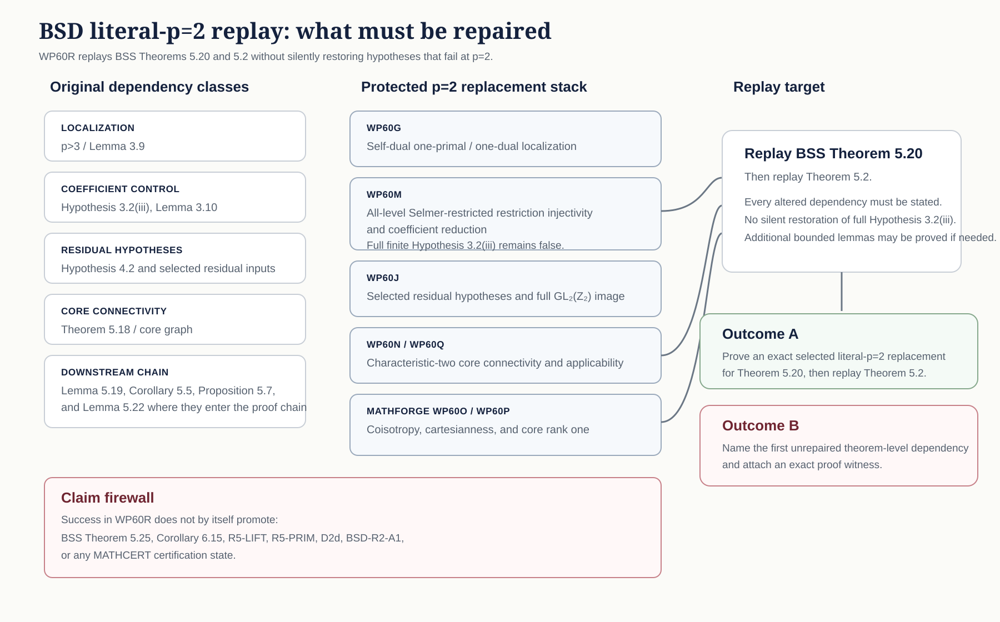
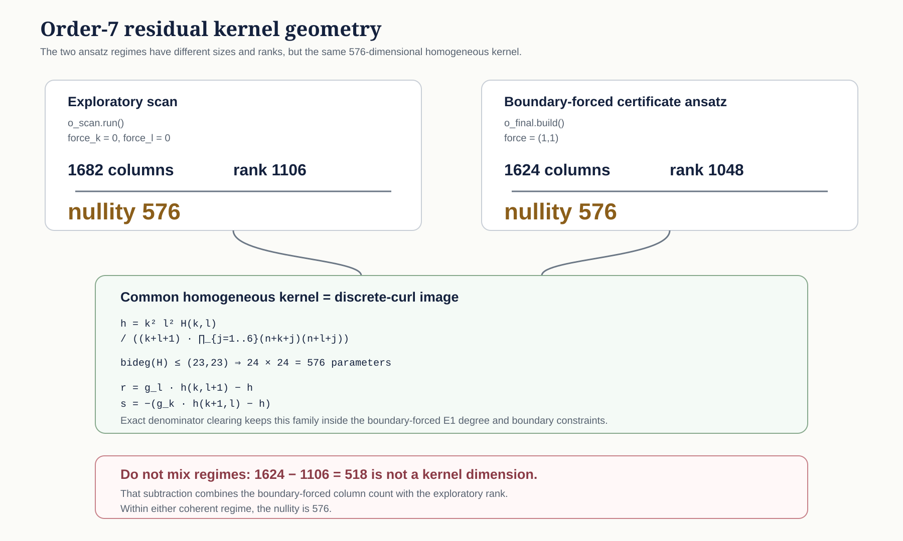

# Grand Challenge Mathematics Programme

Grand Challenge mathematics work uses a three-pillar system:

```text
MATHFORGE  ->  MATHSOLVE  ->  MATHCERT
discover       organize       certify
```

The programme separates discovery, mathematical development, and certification. This separation keeps claim status visible as work progresses.

## What the programme does

The programme turns a mathematical question into a sequence of explicit research states.

- **MATHFORGE** identifies the object, source, pattern, obstruction, or candidate route.
- **MATHSOLVE** turns that material into named obligations, work packages, proof routes, and handoffs.
- **MATHCERT** checks exact statements, evidence, and certificates. It records the claim boundary that survives review.

The three pillars do not assign the same status to every artifact. A source can motivate a claim. A computation can support a claim. A work package can organize a claim. Certification is a separate act.

## How a claim moves through the programme

The following state map shows the normal path and the three fail-closed exits. Each exit records the unresolved state instead of converting it into a positive claim.


The visual distinction is operational. MATHFORGE can stop with a recorded obstruction. MATHSOLVE can stop with unresolved proof debt. MATHCERT can refuse promotion. None of these states is silently upgraded by presentation.

## Why the pillars are separate

Each pillar controls a different transition.

| Pillar | Primary function | Boundary it preserves |
|---|---|---|
| **MATHFORGE** | Reconstruct sources, record signals, run finite screens, and identify candidate routes. | Discovery evidence does not become a mathematical result by presentation alone. |
| **MATHSOLVE** | Build theorem spines, proof obligations, work packages, and exact successor moves. | An active solving campaign does not become a completed result. |
| **MATHCERT** | Replay exact statements, check certificates, and record claim disposition. | Evidence and exposition do not become certified truth without the required checks. |

The distinction is operational:

- **MATHFORGE asks:** What mathematical object or route is available?
- **MATHSOLVE asks:** Which obligations must close before the claim can advance?
- **MATHCERT asks:** Which exact claim survived the applicable checks?

## Current programme fronts

This table shows material programme work that is active now. Row order reflects current programme attention. It does not rank theorem importance or claim strength.

| Frontier | Current obligation | Programme significance |
|---|---|---|
| **BSD-001 — rank-one leading term at literal `p=2`** | [MATHSOLVE #243](https://github.com/grandchallenge/MATHSOLVE/issues/243) replays the Burns–Sakamoto–Sano theorem chain at literal `p=2`. If the replay fails, the campaign must identify the first unrepaired theorem-level dependency. | The work targets one named theorem-level obstruction. It does not generalize the result beyond the retained claim boundary. |
| **VGSE-001 — engineering laws latent in origami structure** | [MATH-PROGRAMME #984](https://github.com/grandchallenge/MATH-PROGRAMME/issues/984) begins from the protected four-claim result and asks which behaviours belong to topology, which are selected by geometry, which are tunable through metric parameters, and which survive physical perturbation. | The objective is not to reproduce one historical drawing. It is to extract reusable mechanical laws and test whether desired behaviour can be designed backward through constraint structure. |
| **OZ-001 — order-7 Brown–Zudilin certificate route** | [MATH-PROGRAMME #964](https://github.com/grandchallenge/MATH-PROGRAMME/issues/964) reduces the 576-dimensional discrete-curl kernel through a degree-minimising Popov or approximant-basis section. The resulting order-7 certificate then requires independent replay. | The work attempts to construct an exact characteristic-zero certificate inside a defined admissible class. Construction and certification remain separate steps. |

Rows appear here only while the work remains materially active. Issue trackers provide navigation. Protected repository records remain authoritative.

[Programme Atlas →](docs/PROGRAMME_ATLAS.md) · [MATHFORGE](https://github.com/grandchallenge/MATHFORGE) · [MATHSOLVE](https://github.com/grandchallenge/MATHSOLVE) · [MATHCERT](https://github.com/grandchallenge/MATHCERT)

### VGSE-001: from reconstruction to engineering discovery

The protected VGSE work has qualified four mathematical claims while leaving the Figure-16-to-pinned-`C` correspondence fail-closed. That gap limits what can be attributed to the historical source, but it does not require GCL to stop at reconstruction.

The new research question is **what reusable engineering laws are latent in the origami structure**. The working model separates four layers: topology defines the admissible mechanism; geometry selects a realization; metric parameters tune response; material and thickness determine physical performance. The first task is to test that hierarchy rather than assume it.

The durable mandate is [`docs/VGSE_ENGINEERING_DISCOVERY_MANDATE.md`](docs/VGSE_ENGINEERING_DISCOVERY_MANDATE.md). It directs agents to build a parameterized design-space model, probe invariants and sensitivities, attempt inverse design, preserve negative results, and keep new GCL realizations distinct from recovered source geometry.

### BSD-001: the current replay problem

WP60R is not a general attempt to “prove BSD at `p=2`.” It is a replay of two specific BSS theorem steps after a protected replacement stack. The diagram below shows which dependency classes are being replaced and the two admissible outcomes.



The important point is the retained failure of full finite Hypothesis 3.2(iii). The replay must use the admitted restricted replacements where they apply. It must not restore the stronger hypothesis by implication or presentation.

### OZ-001: the 576-dimensional kernel

The current order-7 route has two coherent ansatz regimes. Their column counts and ranks differ, but both have nullity `576`. The programme reconstruction identifies that common homogeneous kernel with the discrete-curl image.



This diagram also explains why the earlier value `518` is rejected. It came from subtracting the exploratory rank `1106` from the boundary-forced column count `1624`. Those quantities belong to different ansatz regimes.

## What the programme preserves

The programme is designed so that later work can recover the state of inquiry without relying on informal context.

A continuable campaign should let another researcher or agent answer four questions:

1. What exact object or claim is under study?
2. What evidence supports the current status?
3. Which obligations, limitations, or failure cases remain open?
4. What is the next authorized move?

The programme therefore preserves four properties:

| Property | Required result |
|---|---|
| **Traceability** | A reader can recover the source, evidence, and decision path for a consequential claim. |
| **Executability** | A reader can repeat the relevant computation, reconstruction, proof replay, or validation when reproduction applies. |
| **Bounded claims** | A reader can identify the claim type, status, scope, assumptions, and material limitations. |
| **Continuation** | A new researcher or agent can resume from the recorded state without reconstructing hidden project context. |

This is the practical reason for the programme architecture. The output is not only a mathematical result. The output is a result with enough structure for scrutiny, transfer, and continued work.

## Execution model — protected concurrent execution

The programme operates under `MP-STREAMLINED-EXECUTION-001` and `MP-SUBSTANCE-FIRST-EXECUTION-001`.

Routine bounded administration, documentation, engineering, maintenance, routing, synchronization, and campaign execution use standing delegated authority. A moved branch head does not create a new review requirement by itself.

Specialist non-author review remains required for substantive mathematical certification and source-semantic adjudication. It also remains required for constitutional authority expansion, security-sensitive protection weakening, and external claim promotion.

The primary mathematical or technical artifact remains the object of optimization. Governance, CI, provenance, and release controls must remain proportional to the material risk.

Evidence binds to its material evidence closure. It does not bind indiscriminately to every unrelated repository change.

Protected branches can therefore develop concurrently when four conditions hold:

1. the candidate remains mergeable;
2. relevant dependencies are unchanged;
3. affected checks pass;
4. scope and authority have not widened.

Programme policy CI is impact-routed. `validate-json` is the stable aggregate required context over selected policy shards.

Expensive formal, external, and computational replays use material-identity routing where the policy permits reuse. Scheduled or explicit full sentinels provide broader coverage.

`docs/WORKFLOW_COVERAGE.md` records the current executable coverage and measured evidence.

The earlier administrative workflow rebuild remains historical evidence at [`MP-ADMIN-WORKFLOW-REBUILD-001`](governance/rebuild_evidence/MP-ADMIN-WORKFLOW-REBUILD-001/README.md). Its exact-head review sequence records how that transition was admitted at the time.

## Core repositories

- **MATHFORGE** discovers candidate material: source signals, problem cards, reconnaissance artifacts, finite screens, and route suggestions.
- **MATHSOLVE** organizes solving campaigns: theorem spines, work packages, proof-debt registers, exact obligations, and certification handoffs.
- **MATHCERT** checks the claim boundary: formal statements, exact replays, certificate validators, and claim ledgers.

## Current operating standards

Use these as the current source of truth before opening new doctrine or domain work:

1. `docs/GRAND_CHALLENGE_PEDAGOGY_STANDARD.md` — rails-before-research exposition standard.
2. `docs/PEDAGOGICAL_STYLE_GUIDE.md` — sentence- and artifact-level style companion.
3. `docs/ACCESSIBLE_RESEARCH_GUIDE_STANDARD.md` — prerequisites, examples, fixtures, challenge ladders, certification paths, and continuation graphs.
4. `docs/CHAIDEZ_PEDAGOGICAL_PROTOCOL.md` — theorem-spine campaign protocol.
5. `docs/FOUNDATION_AWARE_MATH_PROGRAMME.md` — structured-object and axiom-profile doctrine.
6. `docs/CLAIM_BOUNDARY_DOCTRINE.md` — claim-status and proof-boundary discipline.
7. `CLASSIFICATION_DISCOVERY_STANDARD.md` — classification, discovery evidence, and knowledge-graph rules.
8. `GRAND_CHALLENGE_WORK_PACKAGE_STANDARD.md` — work-package structure and review discipline.
9. `CLAIM_LEDGER_STANDARD.md` — claim-ledger format, support route, and promotion conditions.
10. `CERTIFICATION_LADDER.md` — promotion gate from mathematical development to certified result.
11. `docs/governance/STREAMLINED_EXECUTION_AMENDMENT.md` — delegation, material closure, concurrency, CI proportionality, merge, and readback rules.
12. `docs/governance/SUBSTANCE_FIRST_EXECUTION_DISCIPLINE.md` — primary-deliverable lock, process proportionality, drift controls, and handoff inheritance.
13. `docs/WORKFLOW_COVERAGE.md` — executable CI coverage, bounded replay, routing, and operational evidence.
14. `docs/governance/AGENT_CADENCE_OPERATING_DESIGN.md` — event-driven and campaign-local cadence interpretation.

## Presentation and pedagogy companions

- `docs/GRAND_CHALLENGE_READER_GUIDE.md`
- `docs/PROGRAMME_ATLAS.md`
- `docs/MINDERLINGS.md`
- `docs/PEDAGOGICAL_STYLE_GUIDE.md`
- `docs/ACCESSIBLE_RESEARCH_GUIDE_STANDARD.md`
- `templates/accessible_research_guide_template.md`
- `docs/CLAIM_BOUNDARY_DOCTRINE.md`
- `docs/CROSS_PILLAR_LANES.md`
- `docs/GLOSSARY.md`

Supporting files include schemas, templates, finite enumerators, audit outputs, resource notes, and Lean scaffolding retained from earlier domains.

## How to use this repository

1. Start with **Current programme fronts** for work that is materially active now.
2. Read `docs/GRAND_CHALLENGE_READER_GUIDE.md` for orientation.
3. Read `ARCHITECTURE_OVERVIEW.md` for the three-pillar architecture.
4. Read the current operating standards before starting governed work.
5. Use `GRAND_CHALLENGE_WORK_PACKAGE_STANDARD.md` and `templates/work_package_template.md` for MATHSOLVE work packages.
6. Use `docs/ACCESSIBLE_RESEARCH_GUIDE_STANDARD.md` when a project needs a human or agentic on-ramp.
7. Treat `CLAIM_LEDGER_STANDARD.md` as binding for consequential claims.
8. Treat `CERTIFICATION_LADDER.md` as the promotion gate for certified results.
9. Use `docs/CROSS_PILLAR_LANES.md` for recurring tactics or certificate paths that span all three pillars.
10. Use `CLASSIFICATION_DISCOVERY_STANDARD.md` for subject mappings and discovery evidence.
11. Use `schemas/foundational_profile.schema.json` for the machine-readable foundation-aware profile.
12. For routine execution, identify the primary deliverable and its material acceptance criteria.
13. Classify the material closure, run affected checks, exercise delegated disposition, merge through protection, and read back protected state.
14. Use `docs/PROGRAMME_ATLAS.md` and governed campaign trackers to locate active, queued, blocked, and historical work.

Historical domain scaffolding remains part of the record. Its presence does not imply current priority.

## Claim boundary

This README is a programme map. It is not a mathematical disposition.

Placement in **Current programme fronts** records current work only. It does not establish proof, refutation, certification, novelty, or priority of discovery.

A source can motivate a claim. A computation can support a claim. A work package can organize a claim. MATHCERT determines the certification status of the exact claim presented to it.

## Communication posture

The README follows the same claim-boundary rule as the rest of the programme. Presentation can expose authority. Presentation cannot create authority.

A useful programme artifact keeps four items visible:

- the object under study;
- the current obstruction or obligation;
- the exact claim boundary;
- the next authorized move.
