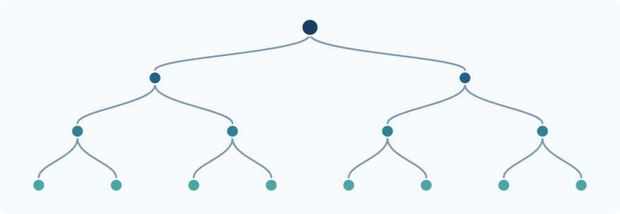

# Condensed Mathematics for the Perplexed

<p class="page-deck">How can one do algebra with spaces without losing their topology? A guided journey from convergent sequences and finite observations to condensed sets, solid abelian groups, and GCL's machine-checked CM4 theorem.</p>

!!! info "What this chapter is — and is not"
    **Status:** introductory mathematical exposition, not a new theorem or certification.
    **Audience:** mathematically curious reader; basic functions, groups, and convergence suffice for the first five sections.
    **Support:** elementary examples can be checked by hand; foundational results are attributed to Clausen–Scholze; the specific GCL result is linked to its protected Lean proof.
    **Boundary:** GCL has *not* formalized all of condensed mathematics, the full derived theory, arbitrary-ring solidity, or liquid mathematics.
    **First exercise:** compare continuous maps from a convergent sequence into the usual and discrete real lines (Section 2).

## The one-sentence idea

**Instead of asking only which points a space contains, ask what continuous maps into it are possible from every profinite test space.** Package those answers so that compatible local observations glue. This produces *condensed sets*. When the answers carry addition, one gets *condensed abelian groups*, an algebraically much better-behaved environment for studying topology and analysis.

The name sounds like a process of squeezing information out. That is misleading: the aim is to **retain** topological information while gaining good algebraic machinery.

### A route through the chapter

| Time | Question | Destination |
| --- | --- | --- |
| 5 minutes | How can the same points have different topologies? | One convergent sequence |
| 10 minutes | What is a profinite test object? | Finite partitions and the Cantor space |
| 15 minutes | What is a condensed set, precisely? | A sheaf condition for compatible probes |
| 20 minutes | Why does algebra improve? | Condensed abelian groups |
| Further reading | What is *solid*, and what did GCL prove? | Measures, Nöbeling freeness, CM4 |

## 1. The difficulty: topology and algebra pull in different directions

The ordinary real numbers support several kinds of structure: a set of points, an abelian group under addition, a ring under multiplication, and a topology describing which sequences converge. In analysis all these structures matter.

The category of ordinary abelian groups is *abelian*: kernels, cokernels, and exact sequences work together in the way homological algebra needs. By contrast, the category of topological abelian groups with continuous homomorphisms is **not** an abelian category. Its topology does not automatically cooperate with its algebraic quotients and image constructions.

Here is a small symptom. Equip the same set $\mathbb R$ with two different topologies:

- $\mathbb R_{\mathrm{disc}}$: every subset is open.
- $\mathbb R_{\mathrm{usual}}$: the ordinary topology of analysis.

The identity map

$$
  \mathbb R_{\mathrm{disc}}\longrightarrow \mathbb R_{\mathrm{usual}}
$$

is continuous, additive, and bijective. Its inverse is *not* continuous. Thus a bijective continuous group homomorphism need not be an isomorphism of topological groups. In an abelian category, such a phenomenon cannot occur for a morphism that is both a categorical monomorphism and epimorphism; in the topological setting it exposes a basic mismatch between algebraic and topological images.

**What we need is not a way to forget topology. We need a way to encode it in a category where familiar algebraic constructions behave well.**

## 2. One observation that knows the difference

Consider the compact space

$$
  E=\{0\}\cup\left\{\frac{1}{n}:n=1,2,3,\ldots\right\}
  \ \subseteq\mathbb R .
$$

It is a convergent sequence together with its limit. Its topology remembers that $1/n$ approaches $0$.

Let $X$ be any topological space. Define

$$
  \underline X(E)=\mathrm{Cont}(E,X),
$$

the set of continuous maps from this *test space* into $X$. Equivalently, elements of $\underline X(E)$ describe convergent sequences in $X$, together with their limits.

Now compare the two real lines:

| Target $X$ | What does a continuous map $E\to X$ represent? |
| --- | --- |
| $\mathbb R_{\mathrm{usual}}$ | An ordinary convergent real sequence |
| $\mathbb R_{\mathrm{disc}}$ | A real sequence that is **eventually constant** at its limit |

For example, the assignment $f(1/n)=1/n$ and $f(0)=0$ is continuous into $\mathbb R_{\mathrm{usual}}$, but **not** into $\mathbb R_{\mathrm{disc}}$.

The two real lines have exactly the same points:

$$
  \underline{\mathbb R_{\mathrm{usual}}}(\ast)
  \;=\;
  \underline{\mathbb R_{\mathrm{disc}}}(\ast)
  \;=\;\mathbb R.
$$

Yet they give different answers on $E$. Looking only at points misses the topology; looking at maps **from test spaces** detects it.

!!! note "Check this by hand"
    In a discrete target, the singleton containing a proposed limit is open. Continuity at the limit point of $E$ therefore forces all sufficiently late sequence terms to equal that limit. Conversely, an eventually constant sequence defines a continuous map into the discrete target.

That is the first essential intuition behind condensed mathematics.

## 3. Why these particular tests? Profinite spaces

A *profinite space* is, equivalently, an inverse limit of finite discrete spaces. Familiar characterizations describe it as compact, Hausdorff, and totally disconnected.

The simple examples matter most:

- A finite set with the discrete topology.
- The Cantor space $S=\{0,1\}^{\mathbb N}$, consisting of infinite binary strings.
- The convergent-sequence space $E$ above, which is also profinite.

A finite test distinguishes different points. An infinite profinite test can distinguish **how points approach one another**.

### The Cantor space as a tower of finite observations

An infinite binary sequence

$$
  s=(s_1,s_2,s_3,\ldots)
$$

can be inspected one digit at a time. The first digit gives a two-way partition; the first two digits give a four-way partition; the first three give eight pieces. The compatible projections are

$$
  \cdots\longrightarrow
  \{0,1\}^{3}\longrightarrow
  \{0,1\}^{2}\longrightarrow
  \{0,1\}.
$$



*The figure shows increasingly fine finite observations of one profinite space. A branch corresponds to a sequence of consistent choices. The picture is a model of finite information, not a proof about every profinite object.*

**The crucial bridge:** If $S$ is profinite, every continuous map $f:S\to\mathbb Z$, where $\mathbb Z$ has the discrete topology, factors through **some finite quotient** $S\to S_i$. This is a consequence of compactness and local constancy.

Notice the order of quantifiers: each $f$ factors through *a* finite quotient; there need not be one fixed quotient suitable for *all* functions.

## 4. A condensed set: the precise definition

We can now give the definition, without making it mysterious.

Let $\mathrm{ProFin}$ be a suitably size-controlled category of profinite spaces and continuous maps. A condensed set is a *sheaf of sets* on this category, with finite jointly surjective families of maps as covers.

In more concrete language, it is a contravariant rule

$$
  F:\mathrm{ProFin}^{\mathrm{op}}\longrightarrow\mathrm{Set},
  \qquad S\longmapsto F(S),
$$

satisfying compatibility conditions.

**Empty and disjoint tests.** The rule satisfies

$$
  F(\varnothing)=\{\ast\},\qquad
  F(S_1\sqcup S_2)\cong F(S_1)\times F(S_2).
$$

**Descent along a surjection.** Whenever $p:T\twoheadrightarrow S$ is a continuous surjection of profinite spaces, an observation on $T$ comes from $S$ exactly when it agrees with itself on overlaps:

$$
  F(S)\;\cong\;
  \bigl\{
     a\in F(T)\mid
     p_1^\ast a=p_2^\ast a
       \text{ in }F(T\times_S T)
  \bigr\}.
$$

Here $p_1,p_2:T\times_S T\to T$ are the two projections. The expression $T\times_S T$ consists of pairs of points in $T$ that map to the same point of $S$.

This is the **sheaf condition**: compatible local descriptions of one object correspond to exactly one global description.

### A familiar space becomes a condensed set

For a topological space $X$, define

$$
  \underline X(S)=\mathrm{Cont}(S,X).
$$

If $u:T\to S$, restriction sends $f:S\to X$ to $f\circ u:T\to X$. The empty/disjoint-set rules are immediate.

Why does descent work? A continuous surjection between profinite spaces is a quotient map: it is a continuous surjection from compact to Hausdorff. Therefore, a continuous $f:T\to X$ that is constant on each fibre of $p$ descends uniquely to a continuous map $S\to X$.

In particular, familiar well-behaved topological spaces embed into a richer language of compatible observations. **A condensed set need not itself arise from an ordinary topological space.**

!!! info "A necessary technical caveat"
    A rigorous general construction controls the sizes of the profinite test objects (typically using an uncountable strong-limit cardinal or an equivalent universe convention). The informal notation $\mathrm{ProFin}$ hides that bookkeeping. Our finite examples and the descent formula do not depend on pretending these size restrictions disappear.

## 5. Condensed abelian groups: when addition travels with the observations

Suppose the answers $F(S)$ are abelian groups, and every restriction map preserves addition. If the same sheaf condition holds, $F$ is a **condensed abelian group**.

For a topological abelian group $A$,

$$
  \underline A(S)=\mathrm{Cont}(S,A)
$$

is an example; continuous maps can be added pointwise.

Why is this useful? Sheaves of abelian groups form an **abelian category**. In the condensed setting we can study exact sequences, kernels, cokernels, and derived methods without imposing ad hoc constructions separately for every kind of topological group.

This does *not* say that all topological problems instantly disappear. It says that the ambient algebraic category has the correct structural machinery. Properties of the original topology still require proofs and may be encoded in subtler ways.

### Return to the two real lines

The map

$$
 \underline{\mathbb R_{\mathrm{disc}}}
   \longrightarrow
 \underline{\mathbb R_{\mathrm{usual}}}
$$

is the identity at the one-point test $\ast$, yet it is not an isomorphism of condensed abelian groups: already the probe $E$ detects the missing non-eventually-constant convergent sequences.

**Lesson:** condensed mathematics does not repair topology by declaring distinct topologies identical. It remembers the distinction at the correct observational level.

## 6. From condensed to solid: a second, more selective construction

Condensed abelian groups are an excellent *ambient* category. But forming tensor products there can still produce unwanted algebraic behavior for analytic purposes. Clausen and Scholze introduce **solid abelian groups** to address this with an appropriate kind of completion-like theory.

Here is the key construction. Write a profinite space as an inverse limit of finite spaces,

$$
  S=\varprojlim_i S_i.
$$

For a finite set $S_i$, let $\mathbb Z[S_i]$ denote the free abelian group on its elements. The condensed object called the **free solid abelian group on $S$** is constructed as

$$
  \mathbb Z[S]^{\square}
    :=\varprojlim_i\mathbb Z[S_i],
$$

with the limit taken in condensed abelian groups. There is a canonical map from the ordinary free condensed abelian group $\mathbb Z[S]$ into this object.

**Definition (informal but faithful to the source).** A condensed abelian group $A$ is *solid* when, for every profinite $S$, every map of condensed sets $S\to A$ extends uniquely to a morphism of condensed abelian groups

$$
  \mathbb Z[S]^{\square}\longrightarrow A.
$$

Equivalently, the natural comparison on morphisms out of the two free constructions has the required bijectivity. It is a **universal extension property**, not a claim that the underlying set is compact or that $A$ contains no holes in the elementary metric sense.

### What does the construction look like for two points?

For a finite discrete space $S=\{a,b\}$, no infinite limit is necessary:

$$
  \mathbb Z[S]^{\square}\cong\mathbb Z[a]\oplus\mathbb Z[b]
  \cong\mathbb Z^2.
$$

An integer-valued measure on $S$ is just two integer weights, say $m_a,m_b$. Acting on a function $f:S\to\mathbb Z$, it gives

$$
  \mu(f)=m_af(a)+m_bf(b).
$$

Nothing unfamiliar happens yet. The construction becomes interesting when $S$ has infinitely many compatible finite quotients.

### What does a measure look like on the Cantor space?

At the first binary partition, choose integer weights $w_0,w_1$. At the next partition, choose $w_{00},w_{01},w_{10},w_{11}$. Compatibility requires

$$
   w_0=w_{00}+w_{01},\qquad
   w_1=w_{10}+w_{11}.
$$

Continuing through all finite levels gives a consistent integer-valued assignment to clopen pieces. That is a concrete way to think about an integer-valued measure here; it does **not** mean one has assumed ordinary countably additive probability measures.

For a general profinite $S$, one obtains the underlying group of such measures as

$$
  M(S,\mathbb Z)
     =\mathrm{Hom}_{\mathbb Z}
        \bigl(C(S,\mathbb Z),\mathbb Z\bigr),
$$

where $C(S,\mathbb Z)$ denotes the **discrete abelian group** of continuous integer-valued functions on $S$.

Nöbeling's theorem says $C(S,\mathbb Z)$ is a free abelian group. Thus, after choosing a basis indexed by some set $I$,

$$
   C(S,\mathbb Z)\cong\bigoplus_{i\in I}\mathbb Z,
   \qquad
   M(S,\mathbb Z)\cong\prod_{i\in I}\mathbb Z.
$$

That basis and product presentation need not be canonical or natural in $S$. Their existence is nevertheless powerful: a complicated measure object becomes accessible through integer coordinates.

### Why the word “free” still requires a theorem

The construction $\mathbb Z[S]^\square$ is a *candidate* free object in the solid category. Its defining formula and attractive name do not, by themselves, prove it is solid.

One must show it satisfies the solid extension property. This distinction is precisely where GCL's CM4 formalization enters.

## 7. The GCL CM4 result: a clearly marked landing point

GCL has proved in Lean the integer-coefficient, **module-level** statement that the profinite solid construction is solid for every profinite space:

$$
 \boxed{
   \forall S:\mathrm{ProFin},\quad
   \mathrm{IsSolid}\bigl(\mathbb Z[S]^{\square}\bigr).
 }
$$

The literal pinned Lean target uses the universe-lifted integer coefficient ring and the concrete mathlib predicate `CondensedMod.IsSolid`. The exact formal theorem is `CMDG.CondensedCM4.cm4Target_via_pointFunctional`.

The **mathematical theorem is not new**: it is a known result of Clausen–Scholze. GCL's contribution is a protected, machine-checked *formalization* using a different **underived Point-functional** proof architecture. Whether that proof architecture is independently novel and suitable for upstream mathlib inclusion is subject to external assessment.

The proof does not attempt to formalize every lecture or reproduce all the original derived arguments. Its basic progression is:

```text
Finite observations of profinite spaces
            |
Locally constant integer functions (Nöbeling coordinates)
            |
Reconstruction of Point-valued measure data
            |
Functionals that detect coefficient morphisms
            |
The mapping-out criterion for solidity
            |
CM4: the free solid object is solid
```

This is a **proof map**, not a claim that each conceptual arrow is automatic or that every earlier part of condensed mathematics is now fully formalized. The actual Lean proof supplies the nontrivial intermediate bridges.

| Claim | Current GCL boundary |
| --- | --- |
| Integer/module-level profinite-solid solidity theorem | Protected, machine-checked |
| Source-derived/complex counterpart | Not established by CM4 |
| Arbitrary-ring generalization | Not established by CM4 |
| All condensed mathematics through Lecture V | **Not** claimed |
| Independent external specialist assessment | Tracked separately; do not infer from repository merge |
| Accepted contribution to current mathlib | Tracked separately; not implied by local proof |

**Continue at the right level:** [CM4 result and precise claim](CMDG_CM4.md) · [mathematical note](CMDG_CM4_MATHEMATICAL_NOTE.md) · [independent replay](CMDG_CM4_REPRODUCIBILITY.md) · [external specialist review](https://github.com/grandchallenge/MATH-PROGRAMME/issues/1222).

## 8. Five misconceptions worth eliminating

**“A condensed set is just a set with a topology.”** No. It is a sheaf on the category of profinite tests. Many familiar spaces give condensed sets, but the construction has more objects than familiar topological spaces.

**“A condensed set forgets convergence.”** The opposite: the maps from the test space $E$ distinguish an ordinary convergent sequence from an eventually constant one.

**“Solid means compact, complete, or rigid in an elementary sense.”** No. Its precise meaning comes from a universal mapping property associated with profinite solid free objects. “Completion” is an analogy with limits.

**“Every condensed abelian group is solid.”** No. Solidity is an additional condition. An excellent ambient abelian category does not make every tensor or functional-analytic construction automatically well behaved.

**“GCL proved condensed mathematics.”** No. GCL has formally proved a significant **restricted theorem within** condensed mathematics, building on pre-existing mathlib infrastructure and further program-local proofs.

## 9. Exercises: from intuition to an honest theorem

| Level | Task | Completion test |
| --- | --- | --- |
| First | Verify continuity of $1/n\to0$ for the two real-line topologies. | Explain exactly why eventual constancy appears for the discrete target. |
| Finite | For $S=\{a,b,c\}$, write every $\mu:C(S,\mathbb Z)\to\mathbb Z$ using three weights. | Show uniqueness from characteristic functions. |
| Cantor | Assign weights to the four length-two binary cylinders and derive the weights for their two parents. | Verify the two additivity equalities. |
| Definition | For $p:T\twoheadrightarrow S$, explain the condition $p_1^\ast a=p_2^\ast a$. | Prove why it means a function is constant on the fibres of $p$. |
| Local theorem | Show that every continuous $f:S\to\mathbb Z$ on a compact profinite $S$ factors through a finite discrete quotient. | Construct a finite clopen partition by its fibres. |
| Specialist | Trace the formal lemma `measurePointIntegralFunctional_zero_reflects` in the CM4 proof. | List exactly which hypotheses make scalar detection faithful. |

The **first reproducible action** for a newcomer is not a large Lean build: prove the finite-quotient factorization proposition directly, write the argument as a short lemma, and compare its hypothesis (compactness, profiniteness, discrete target) with the corresponding constructions in the CM4 research guide.

## 10. Where to read next

**Primary mathematical source:** Peter Scholze, [*Lectures on Condensed Mathematics*](https://arxiv.org/abs/2605.03658) (May 2026 stable edition; material joint with Dustin Clausen). Begin with Lecture I (condensed sets), Lecture II (condensed abelian groups), and Lecture V (solid abelian groups). Definition 5.1, Theorem 5.4 (Nöbeling) and Proposition 5.7 supply the bridge to CM4.

**GCL result and evidence:** [CM4 human-facing result](CMDG_CM4.md), [formal mathematical note](CMDG_CM4_MATHEMATICAL_NOTE.md), [reproducibility protocol](CMDG_CM4_REPRODUCIBILITY.md), [external review packet](CMDG-CM4-EXTERNAL-MATHEMATICAL-REVIEW.md). The [CM4 issue](https://github.com/grandchallenge/MATH-PROGRAMME/issues/355) and protected records govern GCL's certified claim; MkDocs provides the explanatory projection.

**Upstream formalization:** [Mathlib readiness assessment](CMDG-CM4-MATHLIB-UPSTREAM-ASSESSMENT.md) and the [upstream planning issue](https://github.com/grandchallenge/MATH-PROGRAMME/issues/1223). Upstream status is separate from formal replay.

### The picture to keep

A topological space answers “what are its points and which families converge?”. A condensed set answers the richer, algebraically manageable question “for **every profinite probe**, what compatible observations can we make?”. Condensed abelian groups inherit the advantages of an abelian category. Solid abelian groups add a useful universal extension condition for analysis. CM4 checks one substantial place where these layers fit together.
