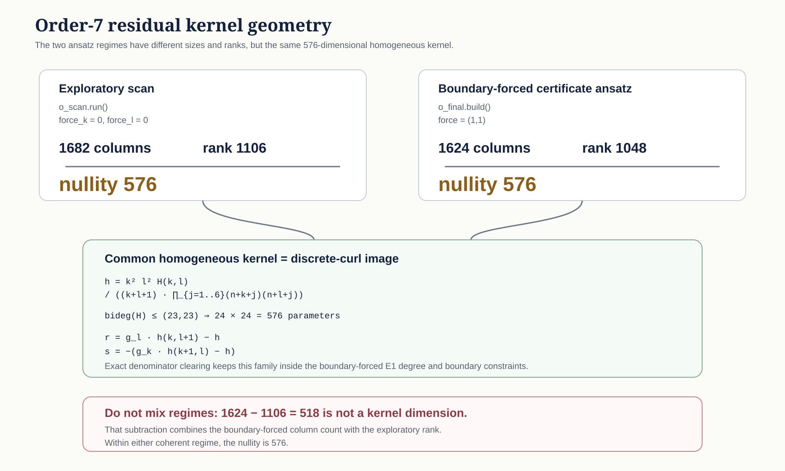

# Current Work

<p class="page-deck">Time-sensitive navigation for material work now in motion. This page does not create mathematical authority; the linked protected records remain authoritative.</p>

## Reading rule

Each highlighted front is described through the same six fields:

1. **Status** — the present support and lifecycle boundary.
2. **Object** — the mathematical or engineering object under study.
3. **Obstruction** — the smallest known reason the next promotion is not yet justified.
4. **Supported state** — what protected work has already established.
5. **Claim boundary** — what the current work does not establish.
6. **Next bounded move** — the next finite action with a completion test.

This structure follows the programme pedagogy standard: status before suspense, object before method, obstruction before optimism, and one executable next move.

The detailed profiles below are a curated public orientation surface, not a complete inventory of active development. Additional active fronts are listed compactly after the highlighted profiles.

<a id="bsd-001--literal-p2-inverse-limit-replay"></a>

## BSD-001 · literal-`p=2` inverse-limit replay

**Live tracker:** [MATHSOLVE #245](https://github.com/grandchallenge/MATHSOLVE/issues/245)  
**Programme owner:** [MATHSOLVE #215](https://github.com/grandchallenge/MATHSOLVE/issues/215)  
**Status:** active solving campaign; MATHCERT certification is not claimed.

### Object

The current object is the inverse-limit passage in Burns–Sakamoto–Sano Theorem 5.25 on the selected literal-`2` lane.

The preceding WP60R replay established the protected finite-level interfaces used for the literal-`2` replacement of Theorem 5.2. The current work asks whether those finite-level interfaces are sufficient for the inverse-limit theorem.

### Obstruction

The published source imposes full Hypothesis 4.7. The protected campaign retains failure of the relevant infinite auxiliary-field H3 / Hypothesis-4.7(iii)-type vanishing condition.

The programme must therefore identify the exact uses of Hypothesis 4.7 in:

- transition maps between finite coefficient levels;
- regulator compatibility;
- the inverse-limit Kolyvagin system;
- compatibility of the ideals `I_i`;
- passage to `Fitt^i_{Z_2}` of the inverse-limit dual Selmer module;
- rank-one freeness and the regulator isomorphism.

### Supported state

WP60R is protected and complete at the finite-level replay boundary. Its replacement stack may be used where admitted. The failed infinite auxiliary-field condition remains failed.

### Claim boundary

This work does not establish Corollary 6.15, R5-LIFT, R5-PRIM, D2d, `BSD-R2-A1`, the failed infinite H3 condition, novelty, priority, or certification.

### Next bounded move

Complete WP60S by one of two admissible outcomes:

- prove a selected literal-`2` replacement of Theorem 5.25 with every inverse-limit compatibility stated; or
- identify the first unrepaired inverse-limit dependency and record it as a named boundary with a proof witness.

The completion test is theorem-level: the replay either closes at the declared boundary or produces the first exact unrepaired dependency.

## OZ-001 · order-7 certificate compression

**Live tracker:** [MATH-PROGRAMME #964](https://github.com/grandchallenge/MATH-PROGRAMME/issues/964)  
**Status:** active certificate-construction route; T3 is neither proved nor refuted.

### Object

The current object is the boundary-forced order-7 E1 residual-cofactor system in the Brown–Zudilin route.

Its homogeneous kernel has dimension `576`. Programme reconstruction identifies that kernel exactly with a discrete-curl image parameterized by a polynomial `H(k,l)` of bidegree at most `(23,23)`.



The visual is an exact structural summary of the two declared ansatz dimensions and the shared nullity. It is not itself a certificate.

### Obstruction

The kernel dimension is no longer the active obstruction. The remaining problem is to construct a degree-reduced affine section over `Q[n]` and then replay it independently in characteristic zero.

The earlier value `518` is not a competing kernel dimension. It came from subtracting the exploratory rank `1106` from the boundary-forced column count `1624`. Those quantities belong to different ansatz regimes.

### Supported state

The current intermediate terminal is:

`ORDER7_E1_KERNEL_IDENTIFIED_AS_DISCRETE_CURL__POTENTIAL_SECTION_REDUCTION_REQUIRED`

Exact denominator clearing, boundary compatibility, and the characteristic-zero kernel inclusion support the `576`-dimensional description. Modular nonzero-minor witnesses supply rank lower bounds. They do not replace characteristic-zero replay of a positive certificate.

### Claim boundary

No global order-7 certificate has yet crossed the declared replay boundary. `t3_proved = false`, `t3_refuted = false`, and the work does not create irrationality, infinitude, novelty, publication, product, or commercial authority.

### Next bounded move

Construct a shifted Popov, minimal-approximant, order-basis, or equivalent completeness-backed affine reduction for the seven standalone residual blocks.

A constructive completion must produce an explicit degree-reduced section. A positive route then requires independent exact replay over `Q(n,k,l)` before the certificate state can advance.

<a id="vgse-001--mechanical-semantics"></a>

## VGSE-001 · TE3-native design to mechanical semantics

**Live campaign tracker:** [MATH-PROGRAMME #1084](https://github.com/grandchallenge/MATH-PROGRAMME/issues/1084)  
**Live M0 tracker:** [MATH-PROGRAMME #1085](https://github.com/grandchallenge/MATH-PROGRAMME/issues/1085)  
**Status:** fresh governed phase; M0 TE3 realization atlas is the only currently authorized substantive tranche.

### Object

VGSE now separates three maps that predecessor work showed must not be conflated:

```text
quotient coordinates x
  -> TE3-consistent geometry g
  -> explicitly defined mechanical behaviour m
```

WP01-WP06 established a mathematical control space and then resolved the geometry-identifiability boundary. They did not establish mechanical semantics.

### Obstruction

The next missing object is not another reconstruction of the five retained C05 branches.

The programme needs genuinely independent GCL-designed TE3-conformant realizations across quotient space. Until those exist, there is no justified design family on which to ask which quotient directions control kinematics or other mechanical observables.

### Supported state

Protected predecessor work establishes:

- an eight-dimensional positive quotient and exact mathematical response inverse;
- exact feasibility relations for the protected response manifold;
- failure of the retained five-branch catalogue to identify a general empirical geometry-to-quotient law;
- an exact `3 closed cycles + 5 boundary paths` invariant decomposition;
- 8/8 geometry identifiability for genuine source-defined TE3 t-embeddings;
- a five-dimensional boundary ambiguity for the broader algebraic-realization class without TE3;
- certified TE3 failure of the retained five C05 branches relative to protected C04.

`VGSE-C06` remains fail-closed and is not on the critical path of the new phase.

### Claim boundary

M0 establishes no mechanics. The campaign currently has no authority for rigid foldability, collision freedom, finite thickness, stiffness, constitutive behaviour, material performance, manufacturability, product performance, novelty, patentability, or commercial value.

### Next bounded move

Execute **M0 — TE3 realization atlas**:

1. pin the exact forward TE3 realization contract;
2. sample genuinely independent quotient points;
3. construct or reject TE3-consistent geometries;
4. replay TE3 independently on every retained success;
5. characterize multiplicity, components, singularities, and conditioning;
6. falsify at least one overbroad realization hypothesis;
7. terminate at one declared M0 disposition.

M1 kinematic semantics and M2 identifiability-aware inverse design remain blocked pending separate protected activation.

[Read the campaign mandate](VGSE_MECHANICAL_SEMANTICS_MANDATE.md)

## Additional active development

The programme's active development surface is broader than the three detailed profiles above. Two additional governed fronts currently in motion are:

| Front | Current state | Next bounded boundary |
| --- | --- | --- |
| **CMDG CM4 P3-M** | Authorized research execution on finite-stage recovery from protected finite-coordinate dependence. | Prove or precisely block the finite-basis-set to common discrete-quotient bridge before attempting broader coefficient-morphism recovery. [Tracker](https://github.com/grandchallenge/MATH-PROGRAMME/issues/662) |
| **NS-CI-001** | Active L5 direct critical-integral lane for the critical `L^4_t L^6_x` Navier–Stokes target; interface qualification only. | Produce a genuinely equation-specific estimate that survives the existing false-proof controls. [Tracker](https://github.com/grandchallenge/MATH-PROGRAMME/issues/55) |

This compact list is also not a substitute for protected campaign registries and live trackers. It exists to prevent the public orientation surface from implying that active development has cardinality three.

## When a front leaves this page

A front should be removed or rewritten when its live obligation is closed, superseded, or transferred to another programme surface. Historical records remain available through the estate, results, issues, and protected repository state.

This page should not preserve a closed issue as though it were still current. That rule is deliberate: current work and standing history are different axes.
