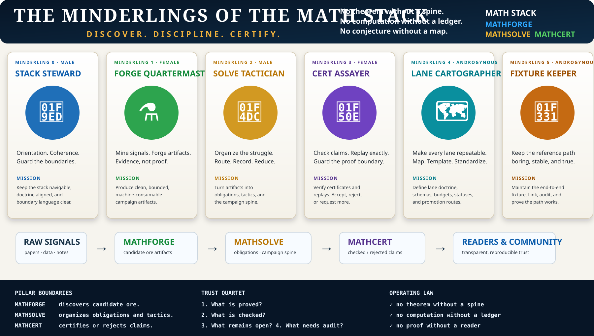

# The Minderlings of the MATH Stack

<p class="page-deck">The Minderlings are the programme's operating cast: six small, bounded roles that keep mathematical work navigable, honest, and ready for audit. They do not replace the pillars. They help the pillars cooperate without collapsing into one another.</p>

<figure>
  
  <figcaption>The Minderlings are an orientation device for coordinating work. They are not authority figures and not theorem-makers.</figcaption>
</figure>

## Why they exist

The mathematics stack now has enough moving parts that coordination itself has become a proof-boundary risk. A role may accidentally promote evidence into a claim, treat a route as certification, or open another work package before the existing spine is auditable.

The Minderlings prevent that drift by keeping each action small, named, and reviewable.

```text
MATHFORGE  -> discovers candidate ore
MATHSOLVE  -> organizes obligations and tactics
MATHCERT   -> certifies or rejects claims

Minderlings -> keep the handoffs legible
```

## Their form

The current cast has six members: two male, two female, and two androgynous Minderlings. The distribution is visual and narrative only; it carries no mathematical authority. The important structure is the role boundary.

| Minderling | Form | Pillar pressure | Governing question |
| --- | --- | --- | --- |
| `M0` Stack Steward | male | whole stack | Can a reader enter the programme and find the boundary? |
| `M1` Forge Quartermaster | female | MATHFORGE | Is the artifact clean, bounded, sourced, and explicitly not proof? |
| `M2` Solve Tactician | male | MATHSOLVE | What exact obligation, tactic, status, and fallback route are now visible? |
| `M3` Cert Assayer | female | MATHCERT | What has actually crossed a replay or proof boundary? |
| `M4` Lane Cartographer | androgynous | cross-pillar lanes | Is this route repeatable, budgeted, and promotion-safe? |
| `M5` Fixture Keeper | androgynous | end-to-end fixtures | Does the reference path still work from intake to certification boundary? |

## Operating law

Every Minderling must protect the same four questions:

1. What is proved?
2. What is checked?
3. What remains open?
4. What requires external verification?

No PR is ready if it answers only the first question.

## Deployment pattern

Use the Minderlings as release roles, not as independent research agents.

| Stage | Lead Minderling | Output |
| --- | --- | --- |
| orientation | Stack Steward | navigation, issue hygiene, linkbacks, pillar boundary language |
| artifact intake | Forge Quartermaster | problem cards, source maps, witness exports, reconnaissance ledgers |
| campaign formation | Solve Tactician | work packages, tactic routes, proof-debt registers, first executable steps |
| certification | Cert Assayer | replay validators, checked ledgers, negative tests, rejected claims |
| route standardization | Lane Cartographer | lane doctrine, schemas, budgets, statuses, promotion routes |
| regression discipline | Fixture Keeper | canonical end-to-end fixtures and stale-path alarms |

## Forbidden promotions

Minderling work must never introduce these promotions:

- candidate artifact to theorem;
- external CAS output to certification;
- finite screen to global proof;
- source citation to proof replay;
- MATHSOLVE campaign language to certified result;
- formal statement with `sorry` to checked theorem;
- visual diagram to mathematical evidence.

The Minderling diagram is therefore a map of responsibility, not a source of truth.

## First use in Release 0.1

The intended first deployment is the release train for rails-before-research work:

```text
M0 -> stack navigation and issue cleanup
M4 -> lane template and resource-budget policy
M1 -> bounded witness fixture
M2 -> tactic-routing record
M3 -> certificate replay validation
M5 -> Union-Closed and TCM fixture ledgers
```

The success condition is deliberately modest: a reader should be able to enter any repository, follow a fixture from raw signal to claim boundary, and know exactly which statements are checked, unchecked, open, rejected, or merely heuristic.
