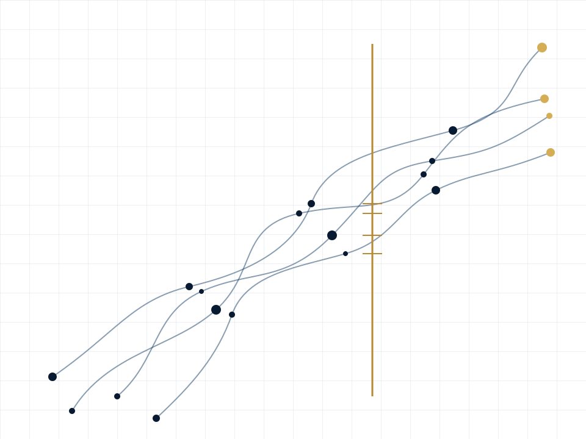

---
hide:
  - navigation
  - toc
---

  
  

    

      Grand Challenge Mathematics
      Programme edition 2026.06
    

    <h1>MATH- PROGRAMME</h1>
    
A public discipline for turning mathematical curiosity into checked understanding.

    
Discovery remains free to imagine. Campaigns make obligations precise. Certification decides what has crossed the proof boundary.

    

      <a class="gc-button gc-button--primary" href="SHOWCASE/">Enter the programme</a>
      <a class="gc-button" href="PROGRAMME_CHARTER/">Read the charter</a>
    

    

      <a class="programme-spine__stage" href="https://github.com/grandchallenge/MATH-PROGRAMME/blob/main/MATHFORGE_SPEC.md">
        I
        MATHFORGE
        Find the real problem
      </a>
      →
      <a class="programme-spine__stage" href="https://github.com/grandchallenge/MATH-PROGRAMME/blob/main/MATHSOLVE_SPEC.md">
        II
        MATHSOLVE
        Build the theorem spine
      </a>
      →
      <a class="programme-spine__stage" href="https://github.com/grandchallenge/MATH-PROGRAMME/blob/main/MATHCERT_SPEC.md">
        III
        MATHCERT
        Check the claim boundary
      </a>
    

  

<section class="gc-section gc-section--manifesto">
  
The binding maxim

  <blockquote class="gc-maxim">No theorem without a spine. No computation without a ledger. No conjecture without a map. No proof without a reader.</blockquote>
</section>

<section class="gc-section gc-section--argument">
  

    
Why this exists

    <h2>Mathematical work can be valuable long before it becomes a theorem.</h2>
  

  

    

      
A serious programme must preserve that value without inflating its status.

      
Definitions clarified, false corridors closed, boundary cases isolated, exact screens built, and proof obligations sharpened are genuine advances. They become cumulative only when another reader can inspect what changed and why.

    

    <dl class="argument-ledger__tests">
      
<dt>Without a map</dt><dd>Promising questions are mistaken for well-posed problems.</dd>

      
<dt>Without a spine</dt><dd>Local insights never assemble into a proof strategy.</dd>

      
<dt>Without a ledger</dt><dd>Computation, intuition, and theorem drift into one another.</dd>

      
<dt>Without a reader</dt><dd>Correct work becomes private knowledge rather than public mathematics.</dd>

    </dl>
  

</section>

<section class="gc-section gc-section--progress">
  

    
What counts as progress

    <h2>Progress is a controlled change in what the programme knows.</h2>
  

  

    
01<strong>Orient</strong>
Reconstruct the source, status, and exact object.
<small>Confusion decreases.</small>

    
02<strong>Reduce</strong>
Turn a broad problem into finite mathematical obligations.
<small>The search space contracts.</small>

    
03<strong>Instrument</strong>
Build examples, exact screens, diagnostics, and ledgers.
<small>Evidence becomes inspectable.</small>

    
04<strong>Prove locally</strong>
Establish a lemma inside a stated dependency boundary.
<small>A claim earns support.</small>

    
05<strong>Certify</strong>
Replay the proof or certificate independently.
<small>Reliance becomes warranted.</small>

  

</section>

<section class="gc-section gc-section--rooms">
  

    
Three different permissions

    <h2>The pillars cooperate because they are not allowed to collapse into one another.</h2>
  

  

    <article>
      <header>I<h3>MATHFORGE</h3></header>
      
Discovery foundry

      
May range widely across sources, examples, analogies, computations, and candidate structures.

      <dl>
<dt>Must produce</dt><dd>A reconstructible map.</dd>

<dt>May not claim</dt><dd>That promising ore is a theorem.</dd>
</dl>
    </article>
    <article>
      <header>II<h3>MATHSOLVE</h3></header>
      
Campaign room

      
Turns questions into definitions, reductions, theorem spines, Work Packages, and explicit next obligations.

      <dl>
<dt>Must produce</dt><dd>A legible campaign.</dd>

<dt>May not claim</dt><dd>That elegant exposition closes a proof.</dd>
</dl>
    </article>
    <article>
      <header>III<h3>MATHCERT</h3></header>
      
Assay office

      
Checks formal proofs, exact replay, interval certificates, SAT/SMT artifacts, and other auditable support routes.

      <dl>
<dt>Must produce</dt><dd>A verdict with a boundary.</dd>

<dt>May not claim</dt><dd>That confidence substitutes for checking.</dd>
</dl>
    </article>
  

</section>

<section class="gc-section gc-section--constitution">
  

    
Programme constitution

    <h2>Six obligations govern every serious artifact.</h2>
  

  <ol class="constitution-list">
    <li>01
<strong>Object before method.</strong>
State what is being studied before announcing machinery.

</li>
    <li>02
<strong>Obstruction before optimism.</strong>
Name the reason the problem remains alive.

</li>
    <li>03
<strong>Status before rhetoric.</strong>
Mark the support class before persuasive exposition begins.

</li>
    <li>04
<strong>Failure remains evidence.</strong>
Record why a route failed and what domain it eliminates.

</li>
    <li>05
<strong>Certification is local.</strong>
Say exactly which statement, assumptions, and dependencies were checked.

</li>
    <li>06
<strong>Understanding survives proof.</strong>
A certified result must still leave a human reader able to see the idea.

</li>
  </ol>
  <a class="text-link" href="PROGRAMME_CHARTER/">Read the full programme charter →</a>
</section>

<section class="gc-section gc-section--boundary">
  

    
The proof boundary

    <h2>Evidence may approach the boundary. Only a valid support route crosses it.</h2>
  

  

    

      LeadHeuristicExact evidenceLocal proofCertified
    

    
<i></i><i></i><i></i><i></i><i></i>

    
proof boundary

  

  

    Conjectural
    Computed
    Provisional
    Certified
    Rejected
  

  
Status is not administrative decoration. It tells the reader what kind of reliance is permitted.

</section>

<section class="gc-section gc-section--current">
  

    
The first domain

    <h2>The programme begins by proving that its method can remain honest.</h2>
  

  

    
Domain 01<strong>Union-Closed Sets</strong>
Infrastructure before theorem claims.

    

The opening programme builds definitions, small exact enumerations, a status spine, Lean-friendly statements, local lemmas, and certification handoffs. It does not present finite sanity checks as progress on Frankl's conjecture.
<a class="text-link" href="REPOSITORY_DOCS/#first-domain">Inspect the domain artifacts →</a>

  

</section>

<section class="gc-section gc-section--entry">
  

    
Choose an entrance

    <h2>Enter by the question you need answered.</h2>
  

  

    <a href="SHOWCASE/">01<strong>What is the whole system?</strong><small>See the programme in one screen.</small></a>
    <a href="GRAND_CHALLENGE_READER_GUIDE/">02<strong>How should I read the work?</strong><small>Use the reader's compact and review lenses.</small></a>
    <a href="PROGRAMME_ATLAS/">03<strong>How does an artifact advance?</strong><small>Follow the route from raw question to checked claim.</small></a>
    <a href="CLAIM_BOUNDARY_DOCTRINE/">04<strong>What may I rely upon?</strong><small>Inspect the doctrine of support and promotion.</small></a>
    <a href="ACCESSIBLE_RESEARCH_GUIDE_STANDARD/">05<strong>How does a new reader begin?</strong><small>Use the accessible research guide contract.</small></a>
  

</section>
