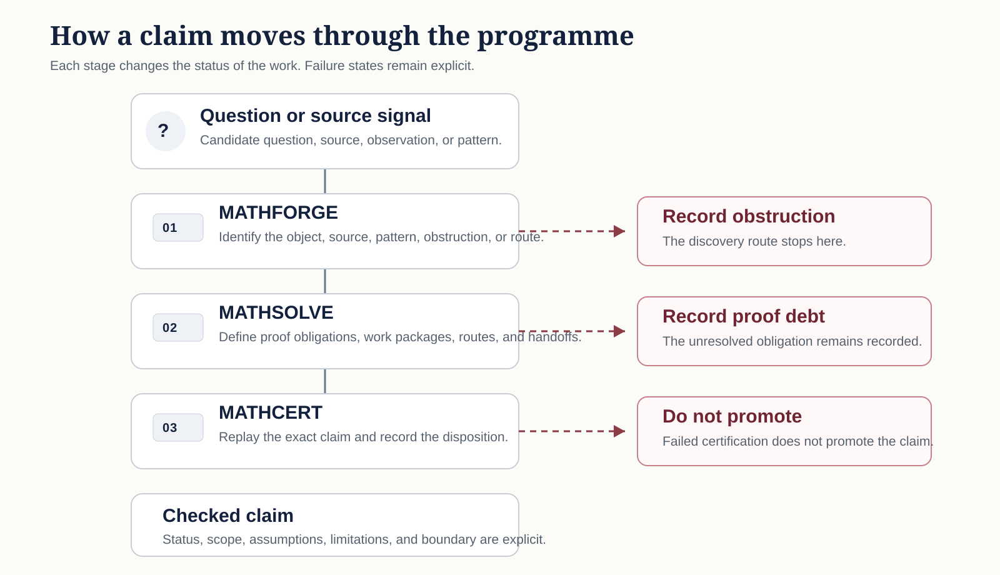
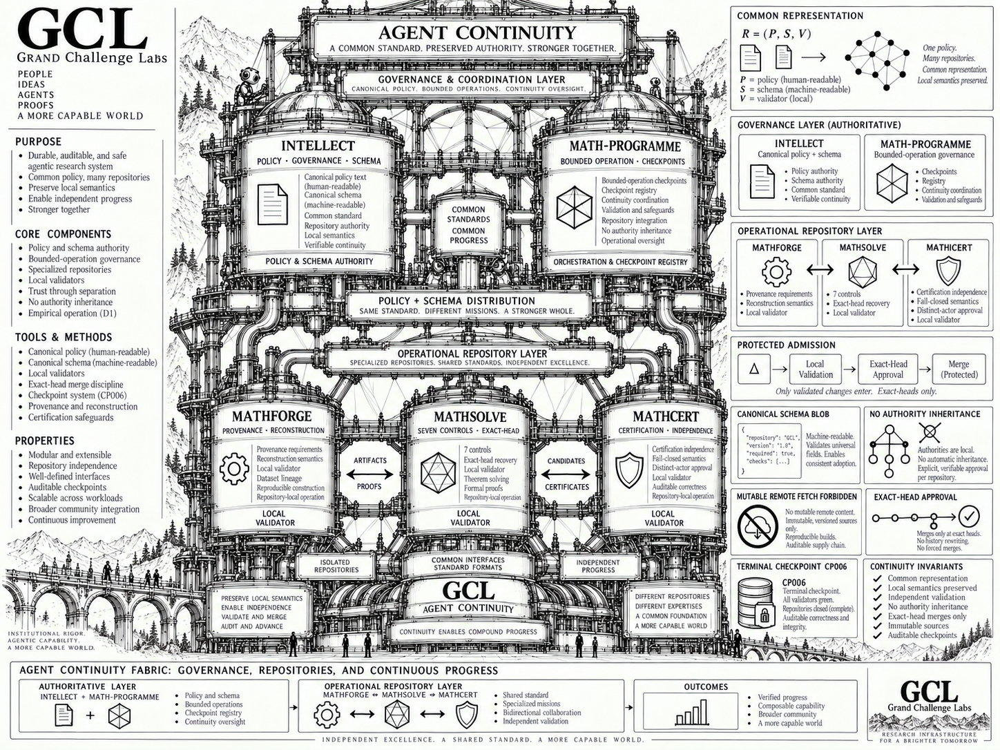

---
hide:
  - navigation
  - toc
---

  

    
Grand Challenge Labs · Mathematics Programme · Edition 2026.09

    <h1>Mathematics Programme</h1>
    
A governed research programme for moving difficult mathematical claims from source reconstruction through proof work to independent certification.

    
The public record separates what is active, what is supported, what remains open, and what has crossed a declared checking boundary.

    

      <a class="home-action home-action--primary" href="CURRENT_WORK/">Current work</a>
      <a class="home-action" href="SHOWCASE/">Results</a>
    

    

      <a class="home-pipeline__stage" href="https://github.com/grandchallenge/MATHFORGE">
        I
        MATHFORGE
        Reconstruct the object, source, and candidate route
      </a>
      →
      <a class="home-pipeline__stage" href="https://github.com/grandchallenge/MATHSOLVE">
        II
        MATHSOLVE
        Close named mathematical obligations
      </a>
      →
      <a class="home-pipeline__stage" href="https://github.com/grandchallenge/MATHCERT">
        III
        MATHCERT
        Check the exact claim presented for certification
      </a>
    

  

## What the programme is

Mathematical discovery, solving, and certification are different research states. The programme keeps those states separate so that evidence cannot acquire a stronger claim merely because it is well presented.

**MATHFORGE** reconstructs the object, source, and candidate route. **MATHSOLVE** organizes and attacks the exact obligations that block progress. **MATHCERT** checks the precise claim and support surface presented to it. **MATH-PROGRAMME** preserves the integrated record, routing, governance, and continuation state; it does not certify mathematics by itself.

## How a claim moves

The diagram is schematic. It teaches programme state transitions, not logical implication between mathematical statements. A route can stop in MATHFORGE with a recorded obstruction, in MATHSOLVE with proof debt, or in MATHCERT with non-promotion. Those exits remain part of the research record.

[Read the Programme Atlas](PROGRAMME_ATLAS.md) for the full state model, support classes, and semantic-bridge requirements.

## The GCL continuity fabric

This public orientation diagram shows how the canonical policy and bounded-operation layers relate to the specialised MATHFORGE, MATHSOLVE, and MATHCERT repositories. The artwork is explanatory, not operative: repository-local policy, protected records, validators, and exact-head evidence remain authoritative. It does not grant authority, certify mathematics, or imply authority inheritance across repositories.

## Current frontier

The table below displays up to twenty material fronts that are in active development. It is a public orientation surface, not the authoritative active-work registry. Row order is for navigation; it does not rank theorem importance, claim strength, or institutional priority.

| Campaign | Current object | Open boundary |
| --- | --- | --- |
| **BSD-001** | Literal-`p=2` replay of the inverse-limit passage in Burns–Sakamoto–Sano Theorem 5.25. [Tracker](https://github.com/grandchallenge/MATHSOLVE/issues/245) | Establish the required transition, regulator, Kolyvagin-system, Fitting-ideal, and rank-one compatibilities without restoring the failed infinite auxiliary-field hypothesis. |
| **OZ-001** | Order-7 boundary-forced residual system with a `576`-dimensional homogeneous kernel identified as a discrete-curl image. [Tracker](https://github.com/grandchallenge/MATH-PROGRAMME/issues/964) | Construct a completeness-backed degree-reduced affine section over `Q[n]`, then independently replay the resulting certificate in characteristic zero. |
| **VGSE-001** | Engineering design-space and response-law extraction over admissible origami realizations. [Tracker](https://github.com/grandchallenge/MATH-PROGRAMME/issues/984) | Separate invariant, tunable, and perturbation-sensitive behaviour while keeping the unresolved source-attribution bridge outside the qualified result. |
| **CMDG CM4 P3-M** | Finite-stage recovery from finite-coordinate dependence; the current successor attacks the pointwise Nöbeling kernel bridge. [Tracker](https://github.com/grandchallenge/MATH-PROGRAMME/issues/664) | Show that the finite-stage information annihilates the relevant kernel functional pointwise, or record the exact missing comparison/separation invariant. |
| **NS-CI-001** | Direct `L^4_t L^6_x` critical-integral decomposition for three-dimensional Navier–Stokes. [Tracker](https://github.com/grandchallenge/MATHSOLVE/issues/59) | Produce an equation-specific integrable estimate that survives the existing low/high-mode, selector, and false-proof controls. |
| **RSI-CCC-001** | Lean 4 formalization of one guarded self-replacement step in the selected stage-indexed model. [Tracker](https://github.com/grandchallenge/MATHSOLVE/issues/248) | Close the CCC, guarded, typed-reflection, refinement, and admission-preservation obligations without adding ambient order enrichment or unrestricted reification. |
| **PNP-BRIDGE-001** | Proof-bearing bridges between imported `P`/`NP` definitions and the Programme machine, encoding, and polynomial-bound conventions. [Tracker](https://github.com/grandchallenge/MATHSOLVE/issues/148) | Establish the carrier, machine-simulation, polynomial-bound, and verifier-class equivalences before any endpoint theorem route can advance. |
| **ASP T8 Noise** | Sub-Gaussian residual-energy certification and finite scaling confrontation for adaptive spectral peeling. [Tracker](https://github.com/grandchallenge/MATHFORGE/issues/115) | Derive and test a valid noisy certificate, including whether `C/Gamma^2` must be replaced by a stronger noise-dependent scaling law. |
| **Type Theory · Volume IV** | `PROTOCOL: Computation as Communication`; composition of the session-type and process-calculus volume through durable RC admission. [Tracker](https://github.com/grandchallenge/MATH-PROGRAMME/issues/877) | Complete the formal manuscript, executable protocol core, proof audit, and durable RC package without conflating protocol fidelity with stronger progress or distributed-correctness claims. |
| **OpenAI Ten Proofs** | Family-specific certification progression across the independently routed proof families. [Tracker](https://github.com/grandchallenge/MATHCERT/issues/43) | Advance only exact family surfaces through route, adjudication, and restricted output gates; no aggregate Ten-Proofs proof or certificate authority is implied. |
| **UC-001** | Active Union-Closed campaign with protected qualification limited to two restricted theorem surfaces and exact finite replay through `n <= 4`. [Protected registry](https://github.com/grandchallenge/MATH-PROGRAMME/blob/main/governance/governed_campaign_registry.json) | Frankl's conjecture and proof obligation `UC-P04` remain open; the finite qualification cannot be generalized to the universal target. |
| **YM-001** | WP01/WP02 gate reconciliation has opened restricted-target selection in MATHSOLVE against retained debts `YM-D001` through `YM-D005`. [Tracker](https://github.com/grandchallenge/MATH-PROGRAMME/issues/164) | Select and bind one exact restricted target without treating continuum reconstruction, regulator survival, positivity, or the mass gap as already established. |
| **RH-001** | Qualified interface for the classical Riemann Hypothesis statement, normalization, zero, and multiplicity conventions. [Tracker](https://github.com/grandchallenge/MATH-PROGRAMME/issues/163) | Any proof lane must open as a Solve-owned restricted target; interface qualification is not mathematical evidence for RH. |
| **HC-001** | Source-normalized rational Hodge interface with bounded qualified semantic/conditional structure. [Tracker](https://github.com/grandchallenge/MATH-PROGRAMME/issues/65) | Select an exact post-WP00 target with variety class, dimension, codimension, coefficient ring, cycle equivalence, and implication direction fixed before proof work. |
| **Type Theory · Volume I Gate 8** | `JUDGMENT` RC1.1 is durably admitted and awaiting genuinely independent mathematical review. [Tracker](https://github.com/grandchallenge/MATH-PROGRAMME/issues/859) | Obtain an attributable `PASS` or justified `PASS_WITH_NONMATERIAL_NOTES`; internal composition audits and CI cannot satisfy Gate 8. |
| **Type Theory · Volume II Gate 8** | `COMPREHENSION` RC1 is durably admitted and awaiting independent theorem- and claim-boundary review. [Tracker](https://github.com/grandchallenge/MATH-PROGRAMME/issues/853) | Complete the independent review on the exact admitted revision; any material mathematical or claim-scope change creates a new review target. |
| **Type Theory · Volume III Gate 8** | `PROOF / PROGRAM` RC1 is durably admitted and awaiting independent mathematical review of the named formal results and explicit non-results. [Tracker](https://github.com/grandchallenge/MATH-PROGRAMME/issues/871) | Complete attributable Gate-8 review without upgrading imported or scoped results; publication authority remains a separate transition. |
| **VGSE-C06 source correspondence** | Fixed-boundary Figure-16 source-semantics repair after the protected matcher failed to identify a source-precision match under the declared relation. [Tracker](https://github.com/grandchallenge/MATHSOLVE/issues/239) | Define any alternative source-authorized equivalence relation before matcher execution; do not broaden the relation after observing failure. |
| **NS-CI claim triage** | Adversarial source review of recent axisymmetric-swirl and broader full-system Navier–Stokes preprints under a protected source lock. [Tracker](https://github.com/grandchallenge/MATHFORGE/issues/20) | Reopen only on an exact repair, a new source revision, or an independently sourced theorem with matching hypotheses; no audited manuscript is promoted by this lane. |
| **NSOF-001 pre-admission controls** | Official source lock and OTP-D semantic clearance exist; generic false-proof fixtures and theorem-ledger preparation may proceed. [Tracker](https://github.com/grandchallenge/MATHSOLVE/issues/89) | Programme active admission, an active Solve campaign manifest, and a content-addressed Cert handoff remain absent; manuscript-specific reconstruction stays blocked until that boundary changes. |

Rows remain here only while the corresponding work is materially active. The [Current Work](CURRENT_WORK.md) page gives deeper profiles for selected fronts; protected repository records and live governed trackers control exact state.

## Where to go next

- **[Current Work](CURRENT_WORK.md)** records live obligations. Use it when the question is what the programme is doing now and what must happen next.
- **[Results and Exemplars](SHOWCASE.md)** records bounded outputs that have crossed a declared checking, publication, or archival boundary. It is not a ranking of importance.
- **[Programme Atlas](PROGRAMME_ATLAS.md)** explains how objects and claims change state across MATHFORGE, MATHSOLVE, MATHCERT, and programme integration.
- **[Mathematical Estate](domains/index.md)** preserves the standing domain catalogue, routes, and archives. Presence there does not imply current priority.

## Claim boundary

This page is a public orientation surface. It does not create or raise mathematical authority. The linked protected records control claim scope, support class, exclusions, and certification state.

[Read the status taxonomy](STATUS_TAXONOMY.md) and [claim-boundary doctrine](CLAIM_BOUNDARY_DOCTRINE.md) when the distinction between evidence, lifecycle state, campaign disposition, and certification matters.
