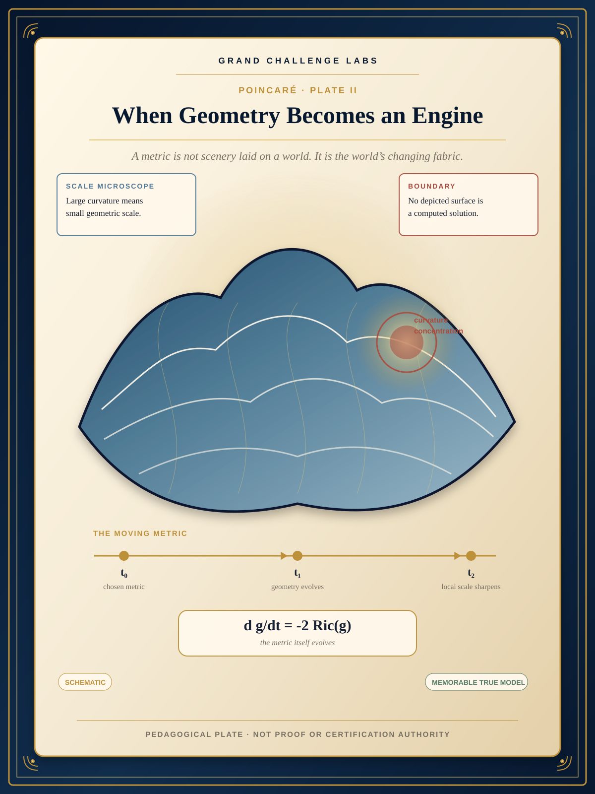
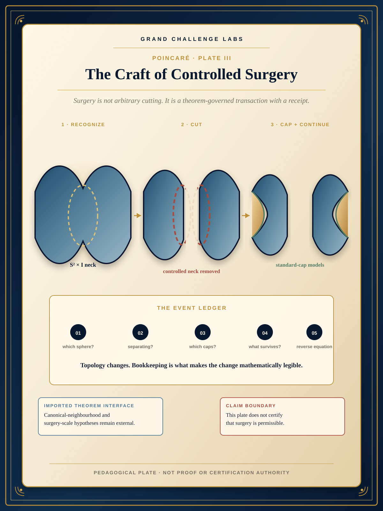
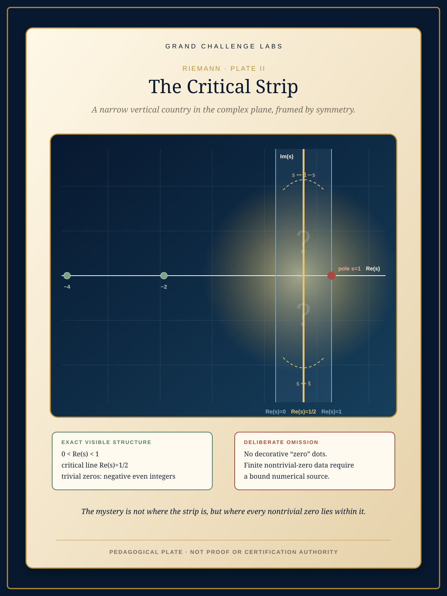
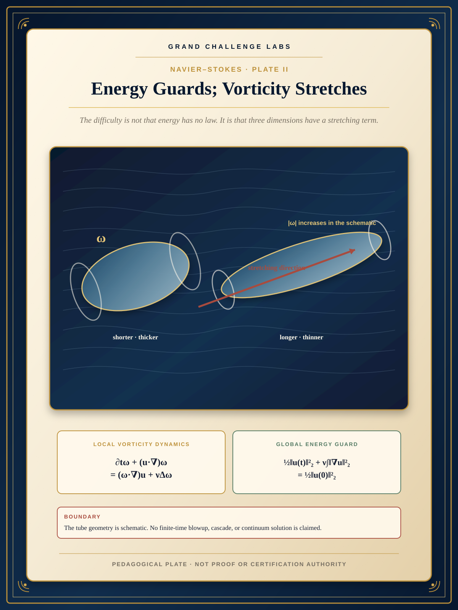
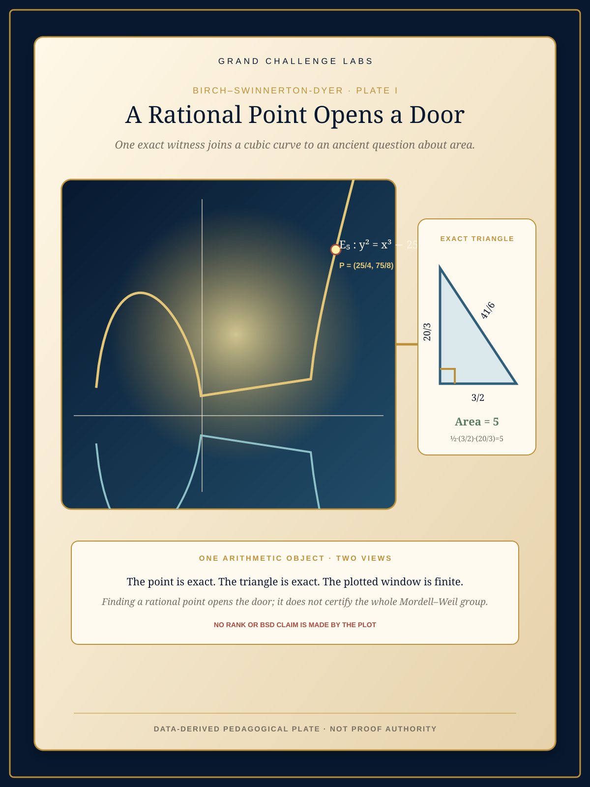
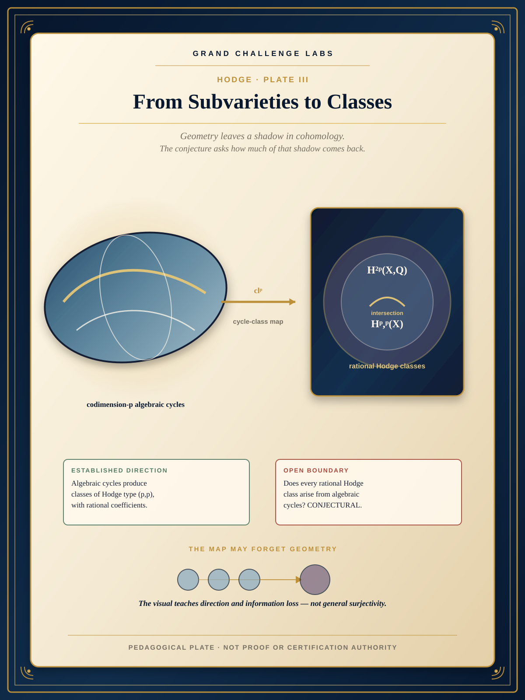

# MP-DOC Visual-Pedagogy Pilot — Review Gallery

Status: **review candidates only**. These assets are not live documentary plates, theorem evidence, or certification authority.

Quality reference: `governance/visual_pedagogy/quality_reference_pc001.json` (`PC-001-VISUAL-QUALITY-REFERENCE`). Review the candidates for both visual-semantic fidelity and literary-pedagogical quality. The reference governs qualities of composition and teaching; it does not require imitation of a particular palette, ornament, typography, or artwork.

## Poincaré — Ricci-flow geometry

## Poincaré — controlled surgery

Print/review derivative: [SVG](poincare/plate_surgery_successor_print.svg)

## Riemann — critical strip

## Navier–Stokes — vorticity stretching

## BSD — congruent-number example

## Hodge — cycle-class map

## Review boundary

Review should answer, at minimum:

1. Does each image give a memorable substantially true mental model within its declared representation class?
2. Are literal and nonliteral features visually distinguishable before they can mislead?
3. Does the composition reveal the intended mathematical relation rather than merely decorate it?
4. Are exact/data-derived elements genuinely bound to the stated source or renderer?
5. Are accessibility, provenance, print/web behavior, and predecessor continuity satisfactory?
6. Does the image remain clearly expository rather than evidentiary?

Any candidate that fails either semantic fidelity or literary-pedagogical quality remains unadmitted.
