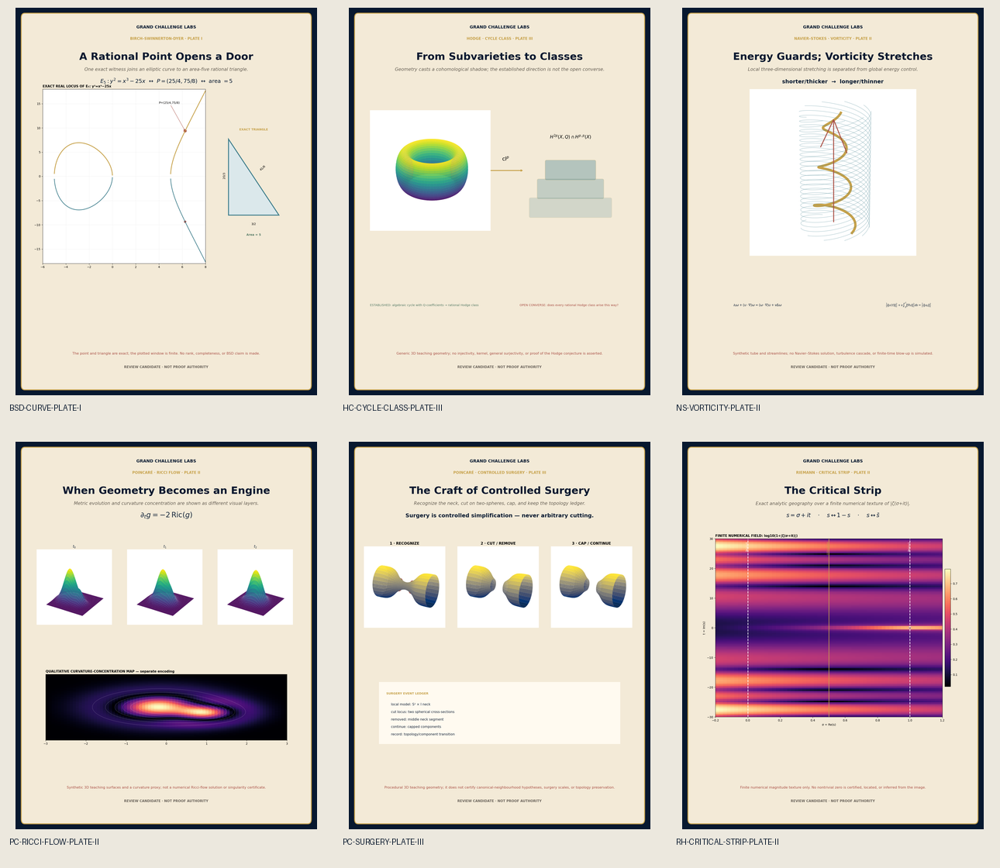
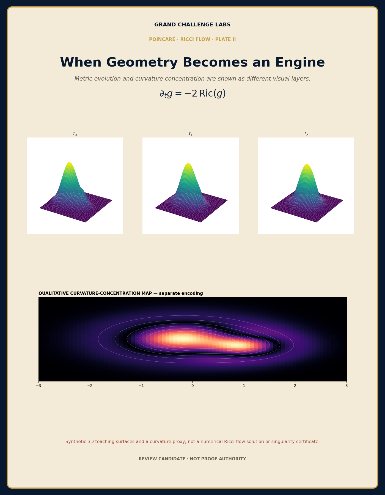
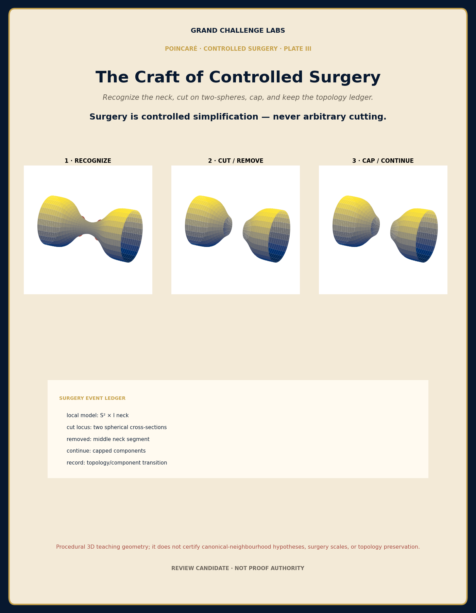
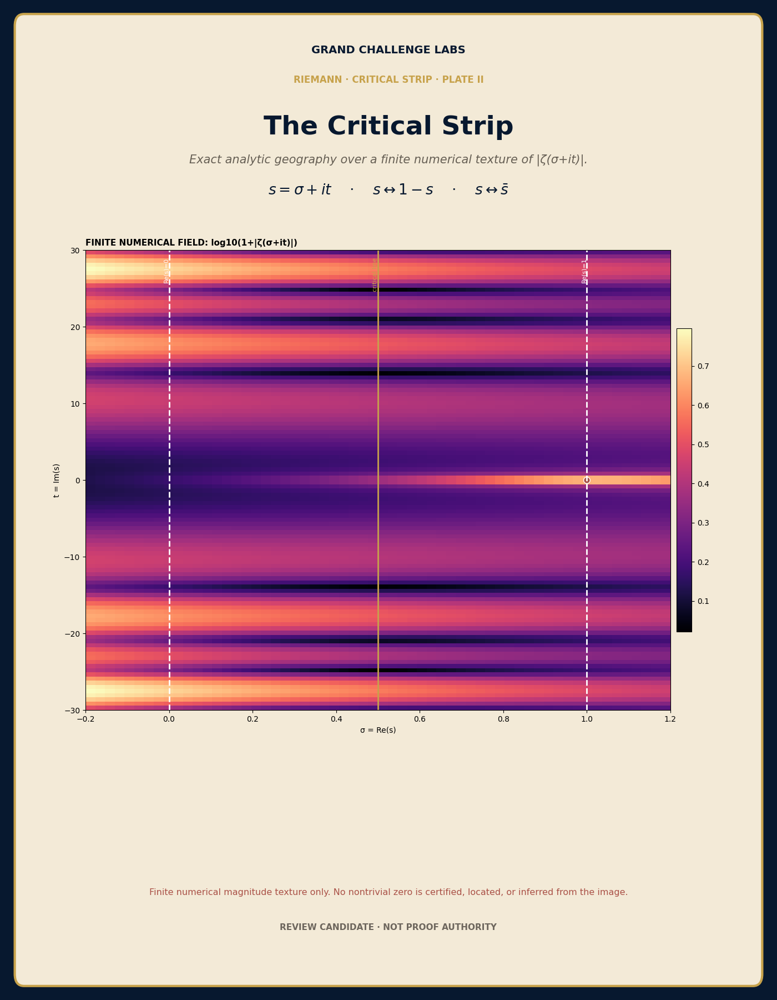
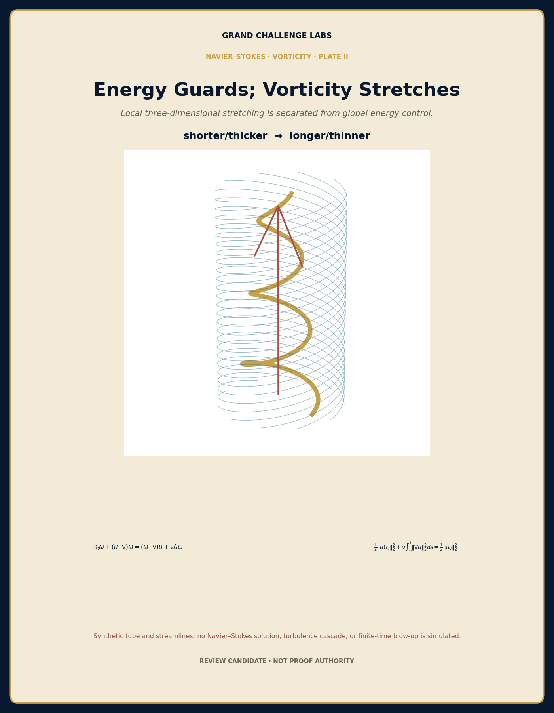
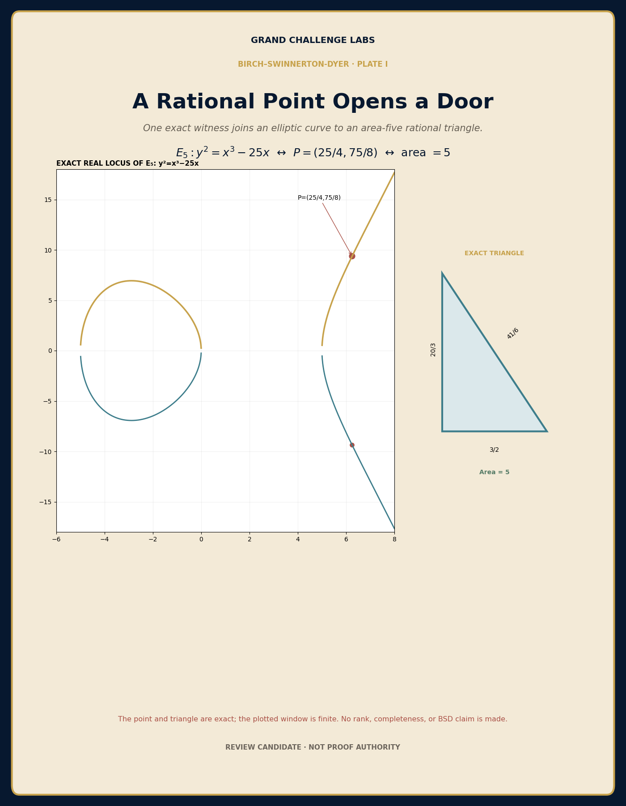
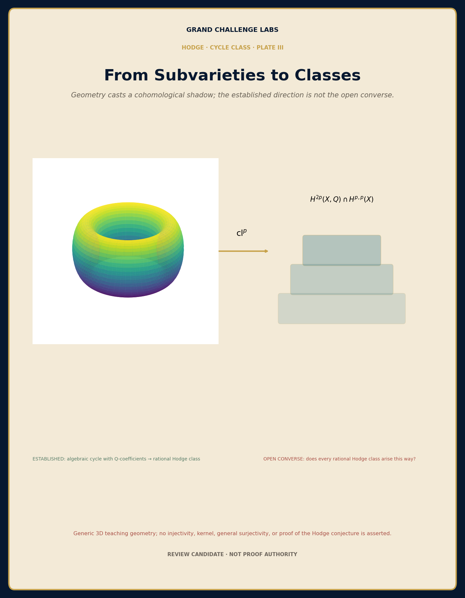

# MP-DOC Visual-Pedagogy Pilot — Representation-Repair Review Gallery

Status: **review candidates only**. These assets are not live documentary plates, theorem evidence, or certification authority.

The first frozen SVG realization was rejected by independent review because the medium did not carry sufficient detail for the required pedagogy. The current review set is therefore a representation-layer repair using deterministic high-resolution raster, 3D, and hybrid scientific rendering. The rejected SVG realization remains in Git history as documentary evidence and is not the current review target.

Quality reference: `governance/visual_pedagogy/quality_reference_pc001.json` (`PC-001-VISUAL-QUALITY-REFERENCE`). Provenance and exact candidate identities are bound by `governance/visual_pedagogy/representation_repair_manifest.json`.

## Single review entry

## Individual current candidates

### Poincaré — Ricci-flow geometry

### Poincaré — controlled surgery

Print/review derivative: [PNG](poincare/plate_surgery_successor_print.png)

### Riemann — critical strip

### Navier–Stokes — vorticity stretching

### BSD — congruent-number example

### Hodge — cycle-class map

## Automated reproducibility

`tools/render_visual_pedagogy_raster_successors.py` deterministically reconstructs all seven PNG derivatives and the contact sheet under the versions pinned in `requirements/visual-pedagogy-render.txt`.

`.github/workflows/visual-pedagogy-representation-repair.yml` rerenders the candidates in an isolated temporary directory, verifies byte-for-byte identity against the committed manifest-bound assets, and publishes the review bundle as a workflow artifact.

## Review boundary

Review should answer, at minimum:

1. Does each image give a memorable substantially true mental model within its declared representation class?
2. Is the chosen representation rich enough for the pedagogical burden, rather than merely more detailed than the rejected SVG?
3. Are literal, data-derived, schematic, and nonliteral features visually distinguishable before they can mislead?
4. Does the composition reveal the intended mathematical relation rather than decorate it?
5. Are data-derived elements genuinely bound to the stated renderer and finite numerical procedure?
6. Are accessibility, provenance, print/web behavior, and predecessor continuity satisfactory?
7. Does the image remain clearly expository rather than evidentiary?

Any candidate that fails semantic fidelity, representation adequacy, or literary-pedagogical quality remains unadmitted.
