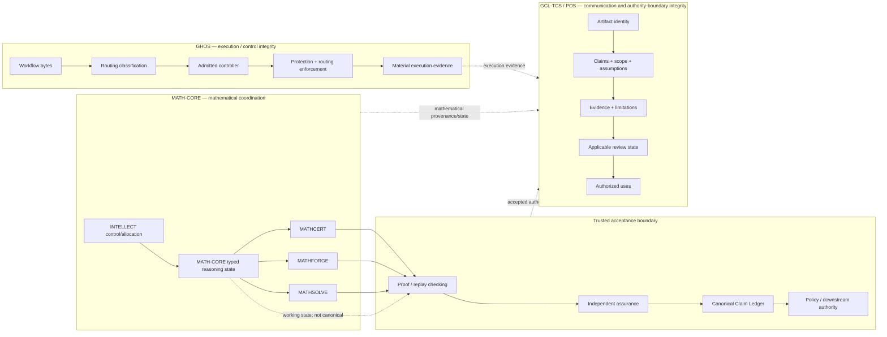
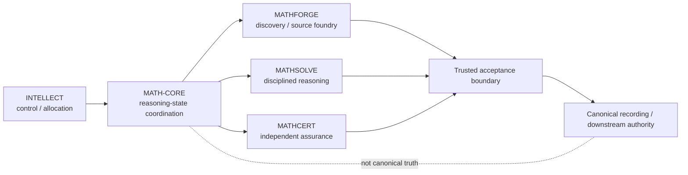
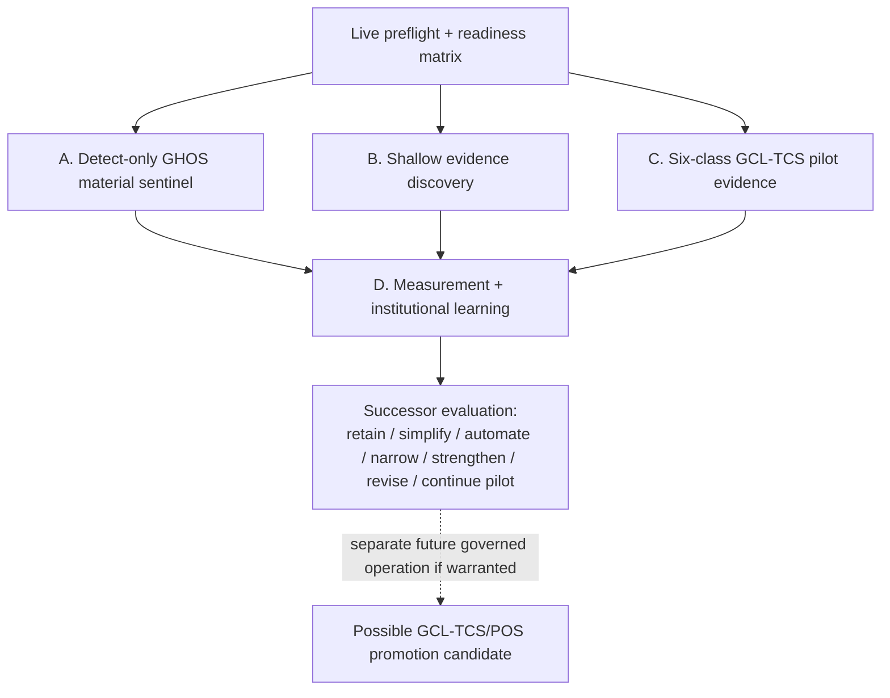
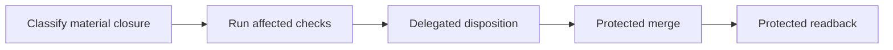
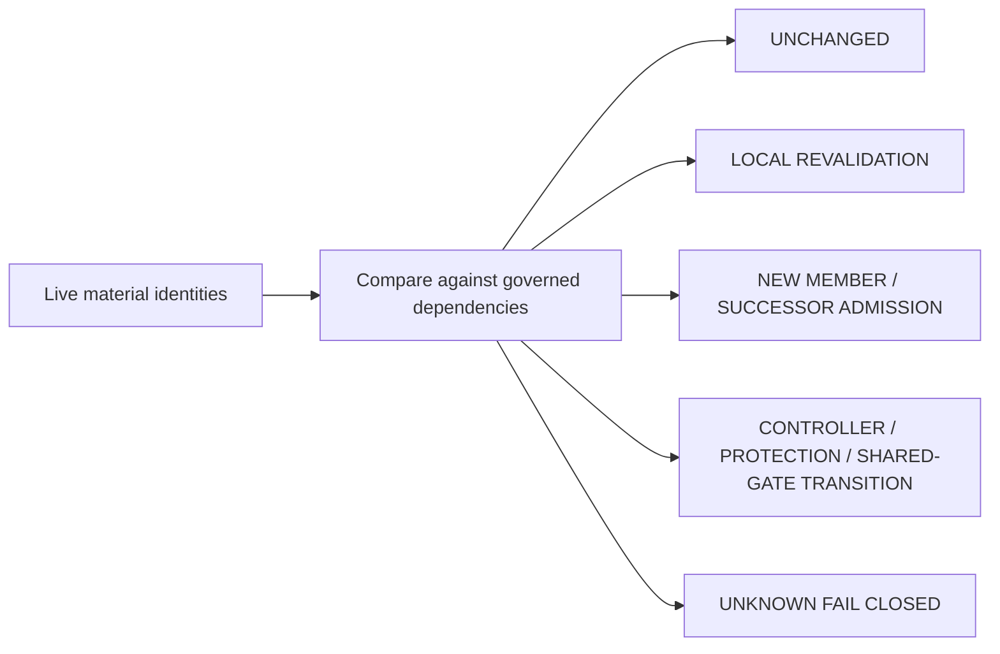
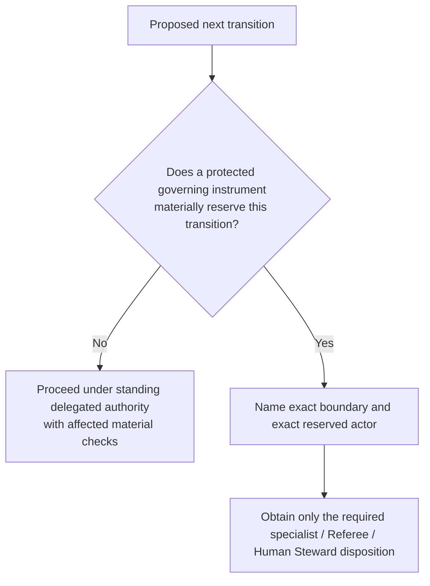

# Codex agent architecture map

This file is the GitHub-native illustration for execution agents. Protected doctrine and live repository state control any conflict.

## Three non-collapsible integrity layers



Do not collapse these layers:

- GHOS answers whether execution routing/controller/protection state is materially governed.
- MATH-CORE answers what typed mathematical reasoning/obligation/conflict/evidence coordination state exists.
- GCL-TCS/POS answers whether artifacts and consequential claims carry inspectable identity, scope, evidence, limitations, provenance, review state and permitted use.
- Trusted acceptance answers what has actually received the applicable proof/replay, assurance, certification, canonical recording and policy disposition.

## MATH-CORE placement



MATH-CORE is not a fourth pillar, proof kernel, MATHCERT, canonical Claim Ledger, canonical truth, or Human Steward authority.

## Successor-operation workstreams



`V1` is not an expected automatic outcome.

## Streamlined routine path



Do not insert Human Steward or Referee boxes into this routine path unless a controlling instrument materially reserves that exact transition.

## Escalation branch

Escalate only for the real boundary, for example:

```text
mathematical/certification authority
constitutional or policy expansion
security-sensitive weakening/controller transition
C04-C07 MATH-CORE capability transition
reserved external publication/claim authority
actual standard-promotion review
unrecoverable authentication/evidence boundary
```

A new commit, another session, ordinary CI pending, a repairable implementation failure, or unrelated `main` movement is not an approval boundary.

## Sentinel contract



The sentinel detects and routes. It does not self-authorize repairs or authority changes.

## Review / authority decision test



Do not infer a reserved gate from importance, template shape, exact-head freshness, or historical ceremony.

## Agent quick reference

1. Re-fetch protected state before trusting any handoff value.
2. Read `STATE.json` as bootstrap only, not authority or checkpoint.
3. Preserve the historical GHOS terminal result; use successor transactions for later state.
4. Build/read the live GCL-TCS v1.0 readiness matrix before selecting pilots.
5. Apply `MATH_CORE_INTEGRITY.md` to mathematical work.
6. Use one execution lead; spawn specialists only for material value.
7. Cite the protected rule before claiming a reserved approval is required.
8. Prefer less ceremony when material protection is equal.
